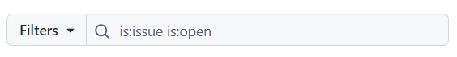

# Б_лог

Это эксперимент по ведению блога на GitHub.

Пока что всё будет выглядеть так:

- файлы с расширением `md` - статьи
- `issue` - комментарии
- `label` - теги
- поиск по тегами или названию статьи - через функционал GitHub
    
