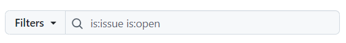

# Б_лог

Это эксперимент по ведению блога на GitHub.

Сайт: <https://4irik.github.io/log/> ([llms.txt](https://4irik.github.io/log/llms.txt) для LLM)

Пока что всё будет выглядеть так:

- файлы с расширением `md` - статьи
- файлы `<имя>.en.md` - английская версия статьи `<имя>.md` (главная на английском - `/en.html`)
- `issue` - комментарии
- `label` - теги
- поиск по тегами или названию статьи - через функционал GitHub
    
