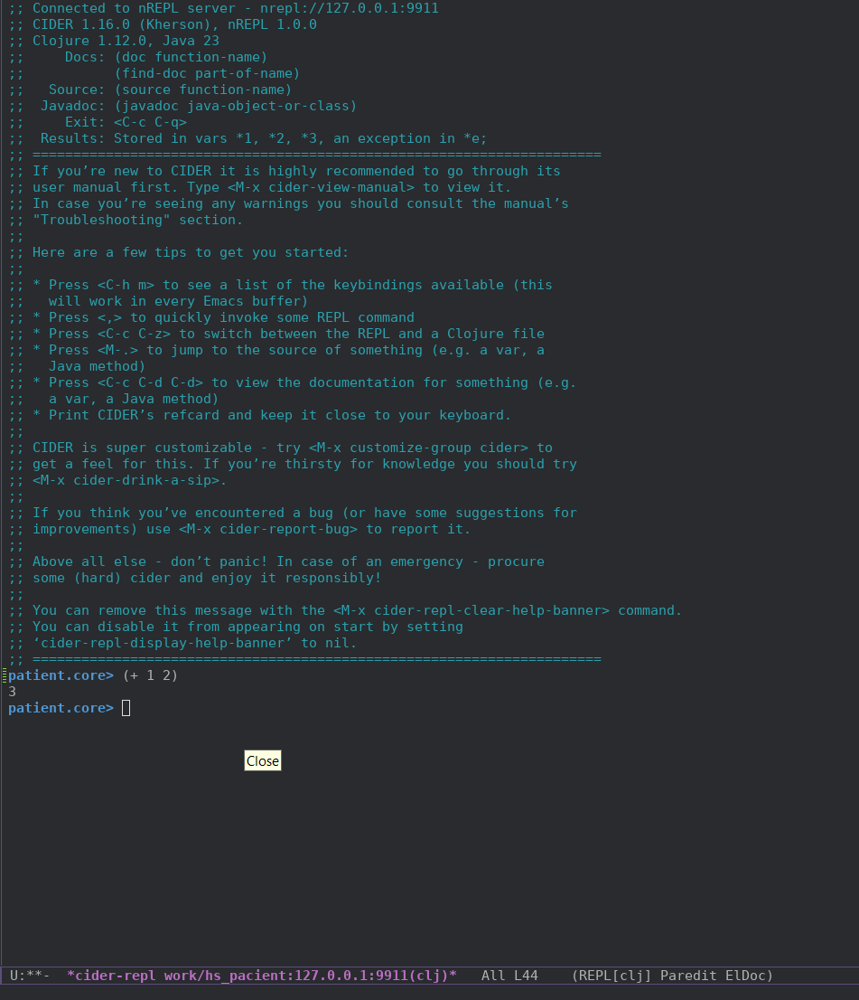

# Writing a simple web app in Clojure

For a long time I've been thinking about writing something in something like Lisp (probably ever since I read a translation of an article about how back in 1996, in the US, people were building things like online stores with it and didn't even consider those who wrote in C/C++ as competitors :D (by the way, does anyone have a link to it?)). I even wrote my own [implementation](https://github.com/4irik/lisphp). Actually, I was planning to use it and polish the things that would come up along the way. But what would that give me in terms of job prospects? Sure, I'd get better at writing programs with lots of parentheses :D, but that's it, and what I really need is to know the tools and the language's quirks. In short: maybe someday.

For a few years now I've been periodically glancing at Clojure and Haskell, I even tried writing hello-worlds in the latter (and even writing PHP in a functional style, but that was: first, hard to read, second, people looked at the code like `:-[ ]` and at me with pity %) ). There's also Lisp Scheme and Racket, but, as far as I know, of the functional languages, only Clojure and Haskell are actually used outside universities these days.

> [!NOTE]
> The code is here - https://github.com/4irik/simple-clojure-web-app.

## Application requirements

 Implement a CRUD application with patient data.

**Dataset:**

- Patient full name
- Sex
- Date of birth
- Address
- OMS (mandatory health insurance) policy number

### Features

- [ ] view the patient list
- [ ] search
- [ ] filtering
- [ ] creation
- [ ] deletion
- [ ] editing
- [ ] validation

### Additionally

- no frameworks
- use vim/emacs
- write tests
- REPL-driven development
- CI (build on commit)
- prepare the product for deployment to K8s
- PgSql as the DBMS

## Preparation

### Infrastructure

As always, we'll work through Docker. Since besides Clojure itself we also have a DBMS, we'll use `docker compose`. 

Let's see if there's anything among Docker images. There is, even an official one - https://hub.docker.com/_/clojure. Reading: 

> 1. leiningen⁠
>    1. The oldest and probably most common tool

this one fits, let's take the latest version. Let's grab pgsql right away too:

*docker-compose.yml:*

```yml
services:
    app:
        image: clojure:temurin-23-lein-alpine
        restart: always
        working_dir: /app
        volumes:
            - ./:/app
    db:
        image: postgres:17.0-alpine3.20
        restart: always
        # set shared memory limit when using docker-compose
        shm_size: 128mb
        # or set shared memory limit when deploy via swarm stack
        #volumes:
        #  - type: tmpfs
        #    target: /dev/shm
        #    tmpfs:
        #      size: 134217728 # 128*2^20 bytes = 128Mb
        ports:
            - 5432:5432
        environment:
            POSTGRES_PASSWORD: pswd
            POSTGRES_DB: patient_db
            PGDATA: ./pgdata

```

*I took the postgres config from the example on the hub page.*

Let's quickly draft a `Makefile`:

```make
help: ## Show this help
	@printf "\033[33m%s:\033[0m\n" 'Available commands'
	@awk 'BEGIN {FS = ":.*?## "} /^[a-zA-Z0-9_-]+:.*?## / {printf "  \033[32m%-18s\033[0m %s\n", $$1, $$2}' $(MAKEFILE_LIST)

build: ## Build containers
	docker compose build

up: ## Run application
	docker compose up -d

down: ## Down application
	docker compose down

restart: down up ## Restart application

shell: ## Shell at clojure docker
	docker compose exec app bash

log: ## Show container logs
	docker compose logs -f
```

### First steps

Since I'm new to Clojure, it took me a while to figure out that `lein` is [leiningen](https://leiningen.org/), the project build tool, and not some specific version of clojure. At first I was looking for something like `clojure` and `clj` inside the docker image and couldn't find it, then everything fell into place.

Let's enter the docker image and create the application skeleton:

*shell:*

```shell
$ make start && make shell
$ lein new patient
```

we got something like this:

*shell:*

```shell
$ tree
.
├── CHANGELOG.md
├── LICENSE
├── Makefile
├── README.md
├── doc
│   └── intro.md
├── docker-compose.yml
├── project.clj
├── resources
├── src
│   └── patient
│       ├── core.clj
├── target
│   ├── classes
│   │   └── META-INF
│   │       └── maven
│   │           └── patient
│   │               └── patient
│   │                   └── pom.properties
│   ├── repl-port
│   └── stale
│       └── leiningen.core.classpath.extract-native-dependencies
└── test
    └── patient
        └── core_test.clj

14 directories, 14 files
```

We have tests, let's try running them:

*shell:*

```shell
$ lein test

lein test patient.core-test

lein test :only patient.core-test/a-test

FAIL in (a-test) (core_test.clj:7)
FIXME, I fail.
expected: (= 0 1)
  actual: (not (= 0 1))

Ran 1 tests containing 1 assertions.
1 failures, 0 errors.
Subprocess failed (exit code: 1)
```

Good, something already works. Let's add test running to the `Makefile`:


*Makefile:*

```Makefile
test: ## Run app tests
	docker compose exec app lein test
```

Let's look into the `core.clj` file:

*core.clj:*

```clj
(ns patient.core)

(defn foo
"I don't do a whole lot."
  [x]
  (println x "Hello, World!"))
```

For something to compile we need to add the `-main` function:

*core.clj:*

```clj
(ns patient.core)

(defn -main
  [& args]
  (println "Hello, World!"))

(defn foo
;; ...
```

Now let's try to build and run all this:

*shell:*

```shell
$ lein run -m patient.core
Hello, World!
```

Add the run command to `Makefile`:

*Makefile:*

```Makefile
run: ## Run application
	docker compose exec app lein run -m patient.core
```

### Editor

I already had Emacs installed and even somewhat preconfigured. Don't remember for what anymore. Here's the part of `init.el` related to this project:

*init.el:*

```lisp
(use-package cider
  :ensure t)

(use-package clojure-mode
  :ensure t)
```

It would be nice to add a REPL. I found this article - https://grishaev.me/clj-repl-part-4/#nrepl-в-docker. Following it:

*project.clj:*

```clj
(defproject patient "0.1.0-SNAPSHOT"
  ;; ...
  :profiles
  {:docker
	{:repl-options {:port 9911
		        :host "0.0.0.0"}
	:plugins [[cider/cider-nrepl "0.50.2"]]}})
```

*docker-compose.yml:*

```yml
services:
    app:
        command: ["lein", "with-profile", "+docker", "repl", ":headless"]
```

Restart our docker image and try to connect from emacs:

```
M-x cider-connect RET 127.0.0.1 RET 9911 RET
```



Great! It would also be nice not to type this line every time we need the `REPL`, but we'll deal with that later. 

## Implementation

Well, since I'm going to write everything in Clojure and ClojureScript, it'll be easier if I solve the tasks gradually. I don't yet know how to write the front or the back. I want to start with the back because it's more familiar to me (and nothing will work without it anyway :D). 

If you search for how to make a web service in Clojure you can find both implementation [examples](https://github.com/chris-emerson/rest_demo) (though it would be nice to have a description of what's what there) and [libraries](https://github.com/metosin/reitit) that do a lot for you.

I'd like to assemble everything myself, so I'll peek at the examples but won't use libraries that already do everything, in order to, so to speak, better feel what it's like.

### Backend

#### Minimal app

A short search led me to a page ["Introduction to web development in Clojure"](https://grishaev.me/clj-book-web-1/). Last time an [article](https://grishaev.me/clj-repl-part-1/) by this author already helped me when I was making multiline input for my [REPL](https://github.com/4irik/lisphp) (actually I got the idea to make it from there too). After skimming the article I decided I'd follow it.

Let's write the initial implementation of the application:

*core.clj:*

```clj
;; ...

(defn app
  [request]
  (let [{:keys [uri request-method]} request]
    {:status 200
     :headers {"Content-Type" "text/plain"}
     :body (format "You requested %s %s"
                   (name request-method)
                   uri)}))
```

To check how this function works I need to compile it, for that I put the cursor on the last parenthesis and press `C-x C-e`, then I switch to the `REPL` (`C-c C-z`) and call it:

*REPL:*

```clj
patient.core> (app {:request-method :get :uri "/index.html"})
{:status 200,
 :headers {"Content-Type" "text/plain"},
 :body "You requested get /index.html"}
```

Everything works. Moving on.

#### Web server

Let's add two packages to the dependencies:

*project.clj:*

```clj
;; ...
:dependencies [[org.clojure/clojure "1.12.0"]
               ;; base web-app
               [ring/ring-core "1.12.2"]
               ;; web-server
               [ring/ring-jetty-adapter "1.12.2"]
               ]
```

To download them we need to run `lein deps`. Let's add this command to the `Makefile` right away:

*Makefile:*

```Makefile
deps: ## Upload dependencies
	docker compose exec app lein deps
```

Let's make the server start when our application is launched via `lein`.

*core.clj:*

```clj
;; ...

(require '[ring.adapter.jetty :refer [run-jetty]])

;; ...

(defn -main
  [& args]
  (run-jetty app {:port 8080 :join? true}))
```

let's forward port `8080` from docker to the outside:

*docker-compose.yml:*

```yml
services:
    app:
        # ...      
        ports:
            - 9911:9911
            - 8080:8080
```

and run our application:

*shell:*

```shell
$ make restart && make run
Retrieving org/apache/commons/commons-parent/52/commons-parent-52.pom from central
Retrieving org/eclipse/jetty/jetty-project/11.0.21/jetty-project-11.0.21.pom from central
Retrieving com/fasterxml/jackson/jackson-bom/2.17.0/jackson-bom-2.17.0.pom from central
...
SLF4J: No SLF4J providers were found.
SLF4J: Defaulting to no-operation (NOP) logger implementation
SLF4J: See https://www.slf4j.org/codes.html#noProviders for further details.
```

No errors, and if we go to `http://127.0.0.1:8080` we'll see:

```text
You requested get /
```

Here you can see that the `app` function worked returning the request method and URL.

**A small digression into infrastructure:**

Everything works, but right now, since I'm on mobile internet, something else matters more to me: stuff keeps downloading and it naturally lands in a directory inside the docker image whose changes don't persist between runs. This way we'll be downloading everything every time. Something has to be done. In [the same article](https://grishaev.me/clj-repl-part-4/#nrepl-в-docker) there are two whole solutions:

1. forward `/root/.m2` to the outside
2. add the `:local-repo` parameter to the `:docker` profile

If we go the second route then everything will always have to be run with that profile specified, otherwise everything that gets downloaded will end up inside the docker container. The first route frees us from having to remember run parameters for anything. We choose it.

*docker-compose.yml:*

```yml
services:
    app:
        # ...
        volumes:
            - ./:/app
            - ./.m2:/root/.m2
```

*Now back to our web application*

#### Routing

Now that something works, it's time to think about routing. In the same article the author describes two options:

1. Compojure
2. Bidi

And a bit below writes:

> Subjectively, Compojure is easier to start with. The library has decent documentation with examples.

That's enough for me. I choose Compojure.

*project.clj:*

```clj
(defproject patient "0.1.0-SNAPSHOT"
  ;; ...
  :dependencies [
                  ;; ...
                  [compojure "1.7.1"]
                ]
  ;; ...
```

I already have a command in the Makefile for installing dependencies, so I don't need to get inside the container itself, it's enough to send `make deps` to the shell.

Let's write basic routes for our application. Since we have CRUD, for working with patient data we need:

1. [ ] - GET - to view the list of records
1. [ ] - POST - to create a record
1. [ ] - GET - to view a record
1. [ ] - PATCH - to make edits
1. [ ] - DELETE - to delete

*I split access to different functionality by HTTP requests to make it easier to grasp what each request does. Later I might change this.*

Let's write stub functions for these methods:

*core.clj:*

```clj
(defn patient-list
  [request]
    {:status 200
    :headers {"content-type" "text/plain"}
    :body "list of patients"})

(defn patient-view
  [request]
    {:status 200
    :headers {"content-type" "text/plain"}
    :body "view patient data"})

;; ...
```

Now, before we go too far, let's make life a bit simpler. Each function returns the same structure:

```clj
{
  :status 200
  :headers {"content-type" "text/plain"}
  :body "some string"
}
```

in which only the value of the `:body` keyword differs. Let's make a helper function:

*core.clj:*

```clj
(defn make-response
  [response-string]
   {:status 200
   :headers {"content-type" "text/plain"}
   :body response-string})

(defn patient-list
  [request]
  (make-response "list of patients"))

(defn patient-view
  [request]
  (make-response "view patient data"))

;;...
```

Let's check it right away:

*REPL:*

```clj
patient.core> (make-response 123)
{:status 200, :headers {"content-type" "text/plain"}, :body 123}
patient.core> (patient-list [])
{:status 200,
 :headers {"content-type" "text/plain"},
 :body "list of patients"}
```

Compojure provides the `defroutes` macro for writing routes, you can write without it but it'll be a bit longer (an example with and without the macro can be found in the [documentation](https://github.com/weavejester/compojure/wiki/Routes-In-Detail#combining-routes)). Let's describe our routes:

*core.clj:*

```clj
;;...
(require '[compojure.core :refer [GET POST PATCH DELETE defroutes]])

;; ...

(defroutes app
  (GET "/"      request (patient-list request))
  (GET "/patient/:id" request (patient-view request))
  (POST "/patient" request (patient-create request))
  (PATCH "/patient/:id" request (patient-update request))
  (DELETE "/patient/:id" request (patient-delete request))
  page-404)
```

Hmm.. we have a group of routes here, the ones starting with `/patient`, we can combine them:

*core.clj:*

```clj
;; ...
;; the `context` macro is added at the end
(require '[compojure.core :refer [GET POST PATCH DELETE defroutes context]]) 

;; ...

(defroutes app
  (GET "/"      request (patient-list request))
  (context "/patient" []
           (POST "/" request (patient-create request))
           (context "/:id{[0-9]+}" [id]
                    (GET "/" request (patient-view request))
                    (PATCH "/" request (patient-update request))
                    (DELETE "/" request (patient-delete request))
                    )
           )
  page-404)
```

here, as you can see, one more macro was added - `context`, and also, I specified that `id` is only digits and it will be available in the nested routes under the `:id` keyword. By the way, let's output this very `:id` in the route responses:

*core.clj:*

```clj
(defn patient-view
  [request]
  (when-let [user-id (-> request :params :id)]
  (make-response (format "view patient #%s data" user-id))))

;; ...
```

Let's check:

*shell:*

```shell
$ curl http://127.0.0.1:8080/patient/1
view patient #1 data
$ curl --request POST http://127.0.0.1:8080/patient
new patient created
```

As you can see, I used the `%s` template instead of `%d`, that's because the `:id` parameter is an object of class `String`, later I think I'll come back to this and change it to `Integer` class.

So, right now we have:

- [x] routes for patient CRUD
- [x] patient `ID` substitution in routes
- [x] route to show the patient list
- [x] 404 handling
- [ ] route to search patients
- [ ] list/search pagination
- [ ] HATEOAS

I'll leave the remaining two items for now, same as I'll postpone the HATEOAS work (here I'm already thinking it will be a REST application after all).

#### Data storage. First approach

So. We need to store data somehow. The task specifies PostgreSql and I even added it to docker-compose.yml already, but I'm not ready to dive headfirst into working with it yet. For now I want to make a stub that keeps everything in memory.

What I want to end up with:

- [ ] getting all records (?)
- [ ] pagination
- [ ] searching records (?)
- [ ] adding a new record
- [ ] deleting a record
- [ ] getting a specific record
- [ ] updating a record

*I put a question mark in parentheses next to the items I'm not sure need doing or don't yet know what form I want them in.*

Found an [article](https://adambard.com/blog/diy-nosql-in-clojure/) describing how to make yourself a store ~~out of sh~~ with improvised means. 

##### Adding a new record

For now I'll do it by analogy without trying to figure out what's what:

*data.clj:*

```clj
(ns patient.data)

;; "Tables"
(def patients (atom []))

;; "Schema"
(def patient-keys [:fio :sex :date-of-birth :address :oms-number])

(defn get-patients
  []
  @patients)

(defn get-patient
  [id]
  (nth @patients id))

(defn put-patient!
  [patient]
  (swap! patients (conj patients patient)))
```

Let's try this thing right away:

*REPL:*

```clj
patient.core> (ns patient.data)
nil
patient.data> (get-patients)
[]
patient.data> (put-patient! {:fio "Иванов И.И" :sex true :date-of-birth "10.10.1910" :address "Some address 11" :oms-number "11223344"})
Execution error (ClassCastException) at patient.data/put-patient! (form-init12253400653348000048.clj:19).
class clojure.lang.Atom cannot be cast to class clojure.lang.IPersistentCollection (clojure.lang.Atom and clojure.lang.IPersistentCollection are in unnamed module of loader 'app')
```

Well, the `get-patients` function works, but insertion is still a problem. Let's read what the original post does on insertion:

```clj
(def MAX-TWITS 5)

(def twits (atom []))

(def twit-keys [:name :message :timestamp])
(defn clean-twit [twit]
  (-> twit
    (select-keys twit-keys)
    (assoc :timestamp (System/currentTimeMillis))))

(defn put-twit! [twit]
    (swap! twits #(take MAX-TWITS (conj % (clean-twit twit)))))
```

OK. Let's make some guesses:

- `take` takes only `MAX-TWITS` from the whole set
- `conj` - adds a record to the end of the vector
- `clean-twit` - adds the current time in milliseconds to the twit
 - `swap!` - updates the `twits` vector

now let's write out the unclear things:

- `conj % ...` - why not `twits` here and what does `%` mean?
- `#(take ...` - no idea what this notation means.

I tried to find what `%` is, but the answer was in the answer to another question - what is `#(...`. So:

- `#(take ...` - a special shorthand for an anonymous function, you could write `(fn [arg ] ...)`
- `%` - parameter substitution in the shorthand anonymous function form; if there were several parameters they'd be denoted by digits - `%1` `%2` etc.

So `#(take...)` is an anonymous function that takes 1 argument and its result is substituted into `twits`. But where does it get its argument? Let's read what [they write](https://clojuredocs.org/clojure.core/swap!) about `swap!`:

> (swap! atom f)
>
> Atomically swaps the value of atom to be:
> (apply f current-value-of-atom args).

I.e. our anonymous function will be applied to the atom's value. There's the answer.

OK, let's try to rewrite the `put-patient!` function:

*data.clj:*
```clj
(defn put-patient!
  [patient]
  (swap! patients #(conj % patient)))
```

*REPL:*

```clj
patient.data> (put-patient! {:fio "Иванов И.И" :sex true :date-of-birth "10.10.1910" :address "Some address 11" :oms-number "11223344"})
[{:fio "Иванов И.И",
  :sex true,
  :date-of-birth "10.10.1910",
  :address "Some address 11",
  :oms-number "11223344"}]
```

It works! Though I still don't get why `(conj patients patient)` doesn't work and `(conj % patient)` does what's needed; for now I'll assume `%` is `current-value-of-atom`, i.e. not the atom itself but the value contained in it. By the way, how can we check that?

I found the `defer` construct (has a shorthand form - `@`) that returns the atom's value. Let's check:

*REPL:*

```clj
patient.data> (conj patients {:test "test"})
Execution error (ClassCastException) at patient.data/eval12859 (form-init12253400653348000048.clj:92).
class clojure.lang.Atom cannot be cast to class clojure.lang.IPersistentCollection (clojure.lang.Atom and clojure.lang.IPersistentCollection are in unnamed module of loader 'app')
patient.data> (conj @patients {:test "test"})
[{:fio "Иванов И.И",
  :sex true,
  :date-of-birth "10.10.1910",
  :address "Some address 11",
  :oms-number "11223344"}
 {:test "test"}]
```

Well, the guess turned out right. But if we look at the examples in the docs, it seems it can be made even simpler:

*REPL:*

```clj
patient.data> (swap! patients conj {:test "test"})
[{:fio "Иванов И.И",
  :sex true,
  :date-of-birth "10.10.1910",
  :address "Some address 11",
  :oms-number "11223344"}
 {:test "test"}]
```

Let's write it that way in our function for adding new records:

*data.clj:*

```clj
(defn put-patient!
  [patient]
  (swap! patients conj patient))
```

##### Deleting a record

*data.clj:*

```clj
(defn del-patient!
  [id]
  (swap! patients ???))
```

 So what can we do here? First thought - `filter`, but it only works with values, and I have an index in a vector. Found a solution on [StackOverflow](https://stackoverflow.com/questions/1394991/clojure-remove-item-from-vector-at-a-specified-location) - use `subvec` and `concat`! Let's try, first in general form:

 *REPL:*

 ```clj
patient.data> (def m [0 1 2 3 4 5 6 7 8 9])
#'patient.data/m
patient.data> (#(vec (concat (subvec %1 0 %2) (subvec %1 (+ 1 %2)))) m 2)
(0 1 3 4 5 6 7 8 9)
 ```

 Works, let's move it into the file:

 *data.clj:*

 ```clj
(defn del-patient!
  [id]
  (swap! patients #(vec (concat (subvec %1 0 %2) (subvec %1 (+ 1 %2)))) id))
```

 *REPL:*

 ```clj
;; let's see what we already have stored
patient.data> (get-patients)
[{:fio "Иванов И.И",
  :sex true,
  :date-of-birth "10.10.1910",
  :address "Some address 11",
  :oms-number "11223344"}
 {:test "test"}
 {:fio "Петров П.П",
  :sex true,
  :date-of-birth "11.11.1911",
  :address "Some address 222",
  :oms-number "22334455"}]
;; delete the record at index `1`
patient.data> (del-patient! 1)
[{:fio "Иванов И.И",
  :sex true,
  :date-of-birth "10.10.1910",
  :address "Some address 11",
  :oms-number "11223344"}
 {:fio "Петров П.П",
  :sex true,
  :date-of-birth "11.11.1911",
  :address "Some address 222",
  :oms-number "22334455"}]
;; the `{:test "test"}` record is gone
```

*A problem is emerging here: if I delete a record, the next one takes its place, this will create problems when we delete records through the web application because the client won't know that **the record identifiers have changed**, or we'll have to send it new identifiers every time.*

Let's leave it for now, we'll come back when we finish all the CRUD operations. *It feels like this solution will create more work for me later, but I really want to move forward at least a little.*

##### Updating a record

It seems that updating a record is very similar to deleting, except that instead of the deleted element we need to substitute a new one:

*data.clj:*

```clj
(defn upd-patient!
  [id patient]
  (swap! patients #(vec (concat (subvec %1 0 %2) [%3] (subvec %1 (+ 1 %2)))) id patient))
```

*REPL:*

```clj
;; replace the address of patient number 2
patient.data> (upd-patient! 1 {:fio "Петров П.П." :sex true :date-of-birth "11.11.1911" :address "new some address 333" :oms-number "22334455"})
[{:fio "Иванов И.И",
  :sex true,
  :date-of-birth "10.10.1910",
  :address "Some address 11",
  :oms-number "11223344"}
 {:fio "Петров П.П.",
  :sex true,
  :date-of-birth "11.11.1911",
  :address "new some address 333",
  :oms-number "22334455"}]
```

Works, but there are two things I don't like:

1. you have to specify the patient index (a related problem was already highlighted in the previous paragraph)
1. you have to send the full dataset

Let's try, for now, to deal with problem #2.

The `assoc` construct(?) allows changing a value in a map:

*data.clj:*

```clj
(defn change-patient-one-value!
  "Changes a single value in a patient record"
  [item key new-value]
  (assoc item key new-value))
```

*REPL:*

```clj
patient.data> (change-patient-one-value! {:test "test"} :test "new value")
{:test "new value"}
```

Next, it seems we can take a map of changes as input and, by reducing it, update the patient data:

*data.clj:*

```clj
(defn change-patient-values!
  "Changes values in a patient record"
  [patient new-values-map]
  (reduce
   #(let [key (%2 0) val (%2 1)] (change-patient-one-value! %1 key val))
   patient
   (seq new-values-map)))
```

*REPL:*

```clj
patient.data> (change-patient-values! {:t1 "test 1" :t2 "test 2" :t3 "test 3"} {:t1 "new test 1" :t3 "new test 3"})
{:t1 "new test 1", :t2 "test 2", :t3 "new test 3"}
```

All that's left is to assemble this in one place:

*data.clj:*

```clj
(defn upd-patient!
  "Updates patient data (only updated fields can be passed)"
  [id new-data-of-patient]
  (swap!
   patients
   #(vec
     (concat
      (subvec %1 0 %2)
      [(change-patient-values! %3 %4)]
      (subvec %1 (+ 1 %2))))
   id
   (@patients id)
   new-data-of-patient))
```

*REPL:*

```clj
patient.data> (upd-patient! 1 {:oms-number "556677"})
[{:fio "Иванов И.И",
  :sex true,
  :date-of-birth "10.10.1910",
  :address "Some address 11",
  :oms-number "11223344"}
 {:fio "Петров П.П.",
  :sex true,
  :date-of-birth "11.11.1911",
  :address "new some address 333",
  :oms-number "556677"}]
```

##### Getting data for a specific record

I already made this method, copying it from the article I mentioned at the beginning:

*data.clj:*

```clj
(defn get-patient
  [id]
  (nth @patients id))
```

but back then I didn't understand how it works. Now, already knowing about atoms and `defer`, the only thing I don't know is what `nth` does. Let's look at the [documentation](https://clojuredocs.org/clojure.core/nth):

> Returns the value at the index. get returns nil if index out of
bounds, nth throws an exception unless not-found is supplied.

i.e. if I specify an index not in the vector I'll get an exception. Seems like that's what's needed, I don't yet know how I'll handle it but I'd like to know when something goes wrong.

*REPL:*

```clj
patient.data> (get-patient 0)
{:fio "Иванов И.И",
 :sex true,
 :date-of-birth "10.10.1910",
 :address "Some address 11",
 :oms-number "11223344"}
patient.data> (get-patient 2)
Execution error (IndexOutOfBoundsException) at patient.data/get-patient (form-init12253400653348000048.clj:15).
null
```

##### Wrapping up

- [x] getting all records (?)
- [ ] pagination
- [ ] searching records (?)
- [x] adding a new record
- [x] deleting a record
- [x] getting a specific record
- [x] updating a record

Almost everything from the plan is done. I'll leave the remaining two items for now, I want the application to work in some form already.

#### Minimal app: adding data storage.

Let's start with adding a new record, then I think we'll check how listing all patients and a specific patient's data works, then we'll get to updating and deleting records. Let's write a list to check against at the end:

- [ ] adding a new patient
- [ ] getting the patient list
- [ ] patient list pagination
- [ ] patient search
- [ ] getting patient data
- [ ] updating patient data
- [ ] deleting patient data

##### Adding

So, first of all, I'd like to see that data arrives. For that we need to take data from the request `body`, as always StackOverflow comes to the rescue, we'll use `slurp` to [turn a stream into a string](https://stackoverflow.com/a/68544475):

*core.clj:*

```clj
(defn patient-create
  [request]
  (make-response (slurp (:body request))))
```

And on the `slurp` documentation page I found a [hint](https://clojuredocs.org/clojure.core/slurp#example-588dd268e4b01f4add58fe33) on how to check all this in the REPL: 

*REPL:*

```clj
patient.core> (patient-create {:body (into-array Byte/TYPE ":test 123")})
{:status 200,
 :headers {"content-type" "text/plain"},
 :body ":test 123"}
```

*shell:*

```shell
$ curl --request POST http://127.0.0.1:8080/patient --data ":fio \"Сидоров С.С.\" :sex true :date-of-birth \"01.01.1901\" :address \"sidorov s.s. address 1\" :oms-number \"778899\""
:fio "Сидоров С.С." :sex true :date-of-birth "01.01.1901" :address "sidorov s.s. address 1" :oms-number "778899"
```

Great!

Now we need to turn this string into a map. Luckily, the answer [was quickly found](https://stackoverflow.com/a/35707024):

*REPL:*

```clj
patient.core> (clojure.edn/read-string "{:a 1 :b 2}")
{:a 1, :b 2}
```

*core.clj:*

```clj
(require '[patient.data :as db])

;; ...

(defn patient-create
  [request]
  (let
      [patient-raw (slurp (:body request))
       patient-map (clojure.edn/read-string (str "{" patient-raw "}"))]
    (db/put-patient! patient-map))
  (make-response nil))
```

*REPL:*

```clj
patient.core> (patient-create {:body (into-array Byte/TYPE ":test 123")})
{:status 200, :headers {"content-type" "text/plain"}, :body nil}
```

*shell:*

```shell
$ curl -D - --request POST http://127.0.0.1:8080/patient --data ":fio \"Сидоров С.С.\" :sex true :date-of-birth \"01.01.1901\" :address \"sidorov s.s. address 1\" :oms-number \"778899\""
HTTP/1.1 200 OK
Date: Wed, 16 Oct 2024 10:36:01 GMT
Content-Type: text/plain
Content-Length: 0
Server: Jetty(11.0.21)
```

##### List of all patients

Seems like we just need to get all patients' data and output it in some form:

*core.clj:*

```clj
(defn patient-list
  [request]
  (make-response (db/get-patients)))
```

*REPL:*

```clj
patient.core> (patient-create {:body (into-array Byte/TYPE ":test 123")})
{:status 200, :headers {"content-type" "text/plain"}, :body nil}
patient.core> (patient-create {:body (into-array Byte/TYPE ":test 222")})
{:status 200, :headers {"content-type" "text/plain"}, :body nil}
patient.core> (patient-create {:body (into-array Byte/TYPE ":test 333")})
{:status 200, :headers {"content-type" "text/plain"}, :body nil}
patient.core> (patient-list [])
{:status 200,
 :headers {"content-type" "text/plain"},
 :body [{:test 123} {:test 222} {:test 333}]}
```

*shell:*

```shell
$ curl http://127.0.0.1:8080
<html>
<head>
<meta http-equiv="Content-Type" content="text/html;charset=ISO-8859-1"/>
<title>Error 500 java.lang.IllegalArgumentException: No implementation of method: :write-body-to-stream of protocol: #&apos;ring.core.protocols/StreamableResponseBody found for class: clojure.lang.PersistentVector</title>
```

Looks like we need to turn the vector of maps into a string:

*REPL:*

```clj
patient.core> (str [{:test 123} {:test 222} {:test 333}])
"[{:test 123} {:test 222} {:test 333}]"
```

*core.clj:*

```clj
(defn patient-list
  [request]
  (make-response (str db/get-patients)))
```

*REPL:*

```clj
patient.core> (patient-list [])
{:status 200,
 :headers {"content-type" "text/plain"},
 :body "patient.data$get_patients@185b5398"}
```

Hmm... that came out a bit different from what I expected, probably because I passed not the function's result to `str` but the function itself. 

*core.clj:*

```clj
(defn patient-list
  [request]
  (make-response (str (db/get-patients))))
```

*REPL:*

```clj
patient.core> (patient-list [])
{:status 200,
 :headers {"content-type" "text/plain"},
 :body "[{:test 123} {:test 222} {:test 333}]"}
```

*shell:*

```shell
$ curl --request POST http://127.0.0.1:8080/patient --data ":fio \"Сидоров С.С.\" :sex true :^Cte-of-birth \"01.01.1901\" :address \"sidorov s.s. address 1\" :oms-n
umber \"778899\""
$ curl --request POST http://127.0.0.1:8080/patient --data ":fio \"Петров П.П.\" :sex true :date-of-birth \"10.10.1910\" :address \"petrov p.p. address 1\" :oms-number \"112233\""
$ curl http://127.0.0.1:8080
[{:fio "Сидоров С.С.", :sex true, :date-of-birth "01.01.1901", :address "sidorov s.s. address 1", :oms-number "778899"} {:fio "Петров П.П.", :sex true, :date-of-birth "10.10.1910", :address "petrov p.p. address 1", :oms-number "112233"}]
```

OK. The patient list exists in some form already.

##### Getting a specific patient's data

Here we act by analogy with the previous point:

*core.clj:*

```clj
(defn patient-view
  [request]
  (let [patient-id (-> request :params :id)]
    (let [patient (db/get-patient patient-id)]
      (if patient
        (make-response (str patient))
        (page-404 [])))))
```

*REPL:*

```clj
patient.core> (patient-view {:params {:id 2}})
{:status 200,
 :headers {"content-type" "text/plain"},
 :body "{:test 333}"}
patient.core> (patient-view {:params {:id 3}})
Execution error (IndexOutOfBoundsException) at patient.data/get-patient (data.clj:17).
null
```

OK, I don't like that instead of 404 I see an exception. In the previous chapter I specifically made the store throw an exception if the record isn't found; back then it seemed that during development it would be convenient to get an exception if data isn't found. I decided so because I wasn't sure I could tell where my `nil` came from: because I did something wrong or because the data isn't in the store. Now I really don't want to write exception handling for a case that can occur often. Let's rework the store so it returns `nil` if nothing is found:

*data.clj:*

```clj
(defn get-patient
  "Returns a patient record by its ID"
  [id]
  (get @patients id))
```

Now everything should be fine:

*REPL:*

```clj
patient.core> (patient-view {:params {:id 1}})
{:status 200,
 :headers {"content-type" "text/plain"},
 :body "{:test 222}"}
patient.core> (patient-view {:params {:id 11}})
{:status 200,
 :headers {"content-type" "text/plain"},
 :body "No such a page."}
```

*shell:*

```shell
$ curl http://127.0.0.1:8080/patient/1
No such a page.
```

Hmm, that's odd. But if you think about it:

*REPL:*

```clj
patient.core> (patient-view {:params {:id "1"}})
{:status 200,
 :headers {"content-type" "text/plain"},
 :body "No such a page."}
```

somewhere above I already wrote that `:id` is an object of class `String`, and now the time has come to convert it to `Integer`.

Compojure has this thing - [parameter coercion](https://github.com/weavejester/compojure/wiki/Destructuring-Syntax#parameter-coercion):

*core.clj:*

```clj
;; ...

(require '[compojure.coercions :refer [as-int]])

;; ...

(defn patient-view
  [id]
  (let [patient (db/get-patient id)]
    (if patient
      (make-response (str patient))
      (page-404 []))))

;; ...

(defroutes app
;; ...
           (context "/:id{[0-9]+}" [id :<< as-int]
                    (GET "/" [] (patient-view id))
;; ...
```

Here I did two things at once:

1. Passed only the parameters it needs to `patient-view`
1. Converted `id` to `Integer` right in the route 

in both cases the changes made in the route helped unload the target function, freeing it from doing things not directly related to its purpose.

*Initially in the route I wrote `(GET "/" id (patient-view id))`, but instead of the identifier a map containing the request header was passed. Haven't figured out why yet.*

*shell:*

```shell
$ curl http://127.0.0.1:8080/patient/1
{:fio "Петров П.П.", :sex true, :date-of-birth "10.10.1910", :address "petrov p.p. address 1", :oms-number "112233"}
```

##### Updating data

*core.clj:*

```clj
(defn patient-update
  [id request]
  (let
      [patient-raw (slurp (:body request))
       patient-map (clojure.edn/read-string (str "{" patient-raw "}"))]
    (db/upd-patient! id patient-map))
  (make-response nil))

;; ...

(defroutes app
;; ...
                    (PATCH "/" request (patient-update id request))
;; ...
```

*REPL:*

```clj
;; add a patient
patient.core> (patient-create {:body (into-array Byte/TYPE ":fio \"Sidorov\" :address \"sidorov s.s. address 1\"")})
{:status 200, :headers {"content-type" "text/plain"}, :body nil}
;; check it was added
patient.core> (patient-view 0)
{:status 200,
 :headers {"content-type" "text/plain"},
 :body
 "{:fio \"Sidorov\", :address \"sidorov s.s. address 1\"}"}
;; change the address
patient.core> (patient-update 0 {:body (into-array Byte/TYPE ":address \"sidorov address 2\"")})
{:status 200, :headers {"content-type" "text/plain"}, :body nil}
;; see if the address changed
patient.core> (patient-view 0)
{:status 200,
 :headers {"content-type" "text/plain"},
 :body
 "{:fio \"Sidorov\", :address \"sidorov address 2\"}"}
```

Works, but a question arises here - "What if the specified record doesn't exist?". 

*REPL:*

```clj
patient.core> (patient-update 10 {:body (into-array Byte/TYPE ":address \"sidorov address 3\"")})
Execution error (IndexOutOfBoundsException) at patient.data/upd-patient! (data.clj:53).
null
```

Could have looked into the code:

*data.clj:*

```clj
(defn upd-patient!
  ;; ...
   (@patients id)
  ;; ...
```

And right away a second one - "How will PgSql behave in this case?". Let's answer it:

*shell:*

```sql
patient_db=# CREATE TABLE test_table (id serial primary key, data text not null);
CREATE TABLE
patient_db=# INSERT INTO test_table ("data") VALUES ('some value 1'), ('some value 2'), ('some value 3');
INSERT 0 3
patient_db=# SELECT * FROM test_table;
 id |     data
----+--------------
  1 | some value 1
  2 | some value 2
  3 | some value 3
(3 rows)

patient_db=# UPDATE test_table SET data='111' WHERE id=1;
UPDATE 1
patient_db=# UPDATE test_table SET data='111' WHERE id=100;
UPDATE 0
patient_db=# SELECT * FROM test_table;
 id |     data
----+--------------
  2 | some value 2
  3 | some value 3
  1 | 111
(3 rows)
```

> [!NOTE]
> Behind the scenes I added a line to the `Makefile`:
>
> *Makefile:*
>
> ```Makefile
> psql: ## PostgreSql shell
> 	docker compose exec db psql -U postgres -d patient_db
> ```

So you can see nothing terrible happens, the DBMS just returns the number of changed records. 

Since I assume my storage layer is somehow tied to the domain being modeled, I won't return the number of changed records, but a flag of whether the record was updated or not. Both flag values don't indicate an error, they're both normal; if there's an error, an exception should be thrown.

*data.clj:*

```clj
(defn upd-patient!
  "Updates patient data (only fields to update can be passed)"
  [id new-data-of-patient]
  (def patient (get-patient id))
  (if (= nil patient)
    false
    (do
      (swap!
       patients
       #(vec
         (concat
          (subvec %1 0 %2)
          [(change-patient-values! %3 %4)]
          (subvec %1 (+ 1 %2))))
       id
       patient
       new-data-of-patient)
      true)))
```

*REPL:*

```clj
patient.data> @patients
[{:fio "Sidorov",
  :sex true,
  :date-of-birth "01.01.1901",
  :address "sidorov address 2",
  :oms-number "778899"}
 {:fio "Petrov",
  :sex true,
  :date-of-birth "10.10.1910",
  :address "sidorov address 3",
  :oms-number "112233"}]
patient.data> (upd-patient! 3 {:sex false})
false
patient.data> (upd-patient! 1 {:sex false})
true
patient.data> @patients
[{:fio "Sidorov",
  :sex true,
  :date-of-birth "01.01.1901",
  :address "sidorov address 2",
  :oms-number "778899"}
 {:fio "Petrov",
  :sex false,
  :date-of-birth "10.10.1910",
  :address "sidorov address 3",
  :oms-number "112233"}]
```

As you can see, everything updates.

*core.clj:*

```clj
(defn patient-update
  [id request]
  (def patient-raw (slurp (:body request)))
  (def patient-map (clojure.edn/read-string (str "{" patient-raw "}")))
  (if (db/upd-patient! id patient-map)
    (make-response nil)
    (page-404 [])))
```

*REPL:*

```clj
;; look at the patient's data
patient.core> (patient-view 0)
{:status 200,
 :headers {"content-type" "text/plain"},
 :body
 "{:fio \"Sidorov\", :sex true, :date-of-birth \"01.01.1901\", :address \"sidorov address 2\", :oms-number \"778899\"}"}
;; change the sex
patient.core> (patient-update 0 {:body (into-array Byte/TYPE ":sex false")})
{:status 200, :headers {"content-type" "text/plain"}, :body nil}
;; make sure the sex changed
patient.core> (patient-view 0)
{:status 200,
 :headers {"content-type" "text/plain"},
 :body
 "{:fio \"Sidorov\", :sex false, :date-of-birth \"01.01.1901\", :address \"sidorov address 2\", :oms-number \"778899\"}"}
;; change data for a non-existent patient
patient.core> (patient-update 1000 {:body (into-array Byte/TYPE ":sex false")})
{:status 200,
 :headers {"content-type" "text/plain"},
 :body "No such a page."}
;; as expected, we saw 404 (or rather the response replacing it)
```

Now everything is as it should be. Only one thing remains: the first 2 lines of the `patient-update` function are not related to its main purpose:

*core.clj:*

```clj
(defn patient-update
  [id request]
  (def patient-raw (slurp (:body request)))
  (def patient-map (clojure.edn/read-string (str "{" patient-raw "}")))
  ;; ...
```

The functionality of extracting patient data from a request and forming a map out of it can be moved into [middleware](https://github.com/weavejester/compojure/wiki/Middleware):

*core.clj:*

```clj

;; adding `wrap-routes`
(require '[compojure.core :refer [GET POST PATCH DELETE defroutes context wrap-routes]])

;; ...

(defn patient-create
  [patient-data]
  (db/put-patient! patient-data)
  (make-response nil))

(defn patient-update
  [id patient-data]
  (if (db/upd-patient! id patient-data)
    (make-response nil)
    (page-404 [])))

(defn wrap-patient-data
  [handler]
  (fn
    [request]
    (let
        [patient-raw (slurp (:body request))
         patient-map (clojure.edn/read-string (str "{" patient-raw "}"))]
      (handler (assoc request :patient-data patient-map)))))

(defroutes app
  ;; ...
           (->
            (POST "/" {:keys [patient-data]} (patient-create patient-data))
            (wrap-routes wrap-patient-data))
            ;; ... 
                    (->
                     (PATCH "/" {:keys [patient-data]} (patient-update id patient-data))
                     (wrap-routes wrap-patient-data))  
                     ;; ...
  )
```

As you can see, along the way I also fixed the `patient-create` function's code.

I'll say right away that I didn't come to the `(-> (...) (...))` route notation right away. At first I wrote like this:

```clj
(defroutes app
  ;; ...
           (wrap-patient-data
            (POST "/" {:keys [patient-data]} (patient-create patient-data)))
            ;; ... 
                    (wrap-patient-data
                     (PATCH "/" {:keys [patient-data]} (patient-update id patient-data)))  
                     ;; ...
  )
```

but I had problems with the `PATCH` method - the `id` parameter value was passed to the `patient-update` function correctly but `patient-data` was an empty map. Having placed prints I found out that the `wrap-patient-data` middleware, in the `PATCH` case, is called twice. At first I didn't understand why, but then I remembered: middleware is applied before it's checked whether the route matches the request:

> If you want middleware to be applied only when a route matches ...

The `wrap-routes` function together with the `->` macro, which allows making a chain of calls, helps avoid this.

##### Deleting

Everything's simple here, but there's one catch:

*REPL:*

```clj
patient.data> (get-patients)
[{:test "1"} {:test "2"} {:test "3"}]
patient.data> (del-patient! 5)
Execution error (IndexOutOfBoundsException) at patient.data/del-patient!$fn (form-init4821922077780103475.clj:27).
null
```

I don't feel like doing anything about it right now, for now I'll check record existence in the route handler:

*core.clj:*

```clj
(defn patient-delete
  [id]
  (if (db/get-patient id)
    (do
      (db/del-patient! id)
      (make-response nil))
    (page-404 [])))

;; ...

(defroutes app
  ;; ...
  (context "/patient" []
           ;; ...
           (context "/:id{[0-9]+}" [id :<< as-int]
                    ;; ...
                    (DELETE "/" [] (patient-delete id))))
  ;; ...
  )
```

*shell:*

```shell
# look at the whole list 
$ curl http://127.0.0.1:8080
[{:fio "Петров П.П.", :sex true} {:fio "Сидоров С.С.", :sex true} {:fio "Иванов И.И.", :sex true}]
# delete the middle record
$ curl --request DELETE http://127.0.0.1:8080/patient/1
# as we can see, two records remain
$ curl http://127.0.0.1:8080
[{:fio "Петров П.П.", :sex true} {:fio "Иванов И.И.", :sex true}]
# try deleting a non-existent record
$ curl --request DELETE http://127.0.0.1:8080/patient/10
No such a page.
```

##### Results

Let's see what's implemented:

- [x] adding a new patient
- [x] getting the patient list
- [ ] patient list pagination
- [ ] patient search
- [x] getting patient data
- [x] updating patient data
- [x] deleting patient data

We'll return to this checklist later, as well as to the others, and now let's move on to the next part of our web application!

### Infrastructure

While we haven't gone far, let's take a step aside and work on infrastructure, namely implement the following two items from the additional task:

- CI (build on commit)
- prepare the product for deployment to K8s

#### CI

So, it turns out, we need, on commit:

1. to run the project build
1. to save the build result somewhere

Let's think about these two items a bit.

**Running the build**

What options do we have? Well, since I develop everything locally, it seems there's only one option - a git hook. But in that case a build will run on every commit, which isn't always needed. There are several solutions:

1. develop features in branches and make the git hook only for the master branch
1. add a flag to the commit that cancels the build (but then the commit message will contain "service garbage" meaningless to a human)
1. use the `--no-verify` flag on commit, but then you have to not forget to set it every time a build isn't needed.

So far it turns out we need either extra actions or constantly keeping in mind the need to write something extra to cancel the build. I don't like that, I want everything to work without me having to think about anything.

Temporary solution - **I'll make the build on demand**, i.e. through the Makefile, and then maybe I'll return to this topic.

Let's see what [Leiningen offers](https://leiningen.org/tutorial.html#what-to-do-with-it) in terms of building the project:

- uberjar - 1 file that requires (it seems) only JRE, well suited for handing to the end user
- tar file and [lein-tar plugin](https://github.com/technomancy/lein-tar) for deployment
- uberjar with embedded Jetti via `ring-jetty-adapter` (which I already have in dependencies)
- war file and [lein-ring](https://github.com/weavejester/lein-ring)

I also googled how people generally deploy their web apps on Java. Everything I found - using jar files. Well, [millions can't be wrong](https://neolurk.org/wiki/Миллионы_не_могут_ошибаться) %). Let's follow their example, **our choice is uberjar**!

**Storing builds**

Say the build went through, what's next? Next we need to save its result somewhere, and in a way that makes it clear which commit it belongs to (otherwise you'll exhaust yourself later figuring out where and when something broke, and it'll be especially fun if a new build is needed urgently):

- save the build result to a separate place
- the build must know which commit it was built from

We also have K8s preparation in the tasks, and that thing works with docker or rkt (I'm not very strong in it, saw it once, from afar, somehow). This means we can already use docker now to prepare for the next stage and this solves both problems at once: we'll store everything in docker images (whether pushing to a public hub, a private one, or keeping them on the local machine) and image tags will be formed with the hash of the git commit the app was built from.

Decided! **We make a docker image build** with a prod-ready application.

##### Docker image for building and running

First let's try building the application ourselves:

*shell:*

```shell
$ lein uberjar
Created /app/target/patient-0.1.0-SNAPSHOT.jar
Created /app/target/patient-0.1.0-SNAPSHOT-standalone.jar
$ java -jar /app/target/patient-0.1.0-SNAPSHOT-standalone.jar
Clojure 1.12.0
user=> ^C
```

It built but not what I expected, let's see what I wrote in the Makefile for running the application:

*Makefile:*

```Makefile
run: ## Run application
	docker compose exec app lein run -m patient.core
```

`lein run -m patient.core` - i.e. I explicitly specify which namespace to use... hmm, looks like it's time to look at the [documentation](https://leiningen.org/tutorial.html#uberjar):

> ... you’ll need to specify a namespace as your :main in project.clj and ensure it’s also AOT (Ahead Of Time) compiled by adding it to :aot ..
> ...
> (defproject 
> ... 
>  :main my-stuff.core
>  :aot [my-stuff.core])

Let's add this to our project file:

*project.clj:*

```clj
(defproject patient "0.1.0-SNAPSHOT"
  ;; ...
  :main patient.core
  :aot [patient.core])
```

Let's try to build:

*shell:*

```shell
$ lein uberjar
Compiling patient.core
SLF4J: No SLF4J providers were found.
SLF4J: Defaulting to no-operation (NOP) logger implementation
SLF4J: See https://www.slf4j.org/codes.html#noProviders for further details.
Warning: The Main-Class specified does not exist within the jar. It may not be executable as expected. A gen-class directive may be missing in the namespace which contains the main method, or the namespace has not been AOT-compiled.
Created /app/target/patient-0.1.0-SNAPSHOT.jar
Created /app/target/patient-0.1.0-SNAPSHOT-standalone.jar
$ java -jar /app/target/patient-0.1.0-SNAPSHOT-standalone.jar
Error: Could not find or load main class patient.core
Caused by: java.lang.ClassNotFoundException: patient.core
```

Reading the documentation further:

> .. This namespace should have a (:gen-class) declaration in the ns form at the top ..
>
> (ns my-stuff.core
>   (:gen-class))


OK, let's mark the namespace:

*core.clj:*

```clj
(ns patient.core
  (:gen-class))
;; ...
```

*shell:*

```shell
# run the build
$ lein uberjar
Compiling patient.core
SLF4J: No SLF4J providers were found.
SLF4J: Defaulting to no-operation (NOP) logger implementation
SLF4J: See https://www.slf4j.org/codes.html#noProviders for further details.
Created /app/target/patient-0.1.0-SNAPSHOT.jar
Created /app/target/patient-0.1.0-SNAPSHOT-standalone.jar
# now let's try to run it
$ java -jar /app/target/patient-0.1.0-SNAPSHOT-standalone.jar
SLF4J: No SLF4J providers were found.
SLF4J: Defaulting to no-operation (NOP) logger implementation
SLF4J: See https://www.slf4j.org/codes.html#noProviders for further details.
```

Great, we've figured out the build. Now let's work on the docker file for building and subsequent running.

*./build/Dockerfile:*

```Dockerfile
FROM clojure:temurin-23-lein-alpine AS builder

RUN mkdir /app
WORKDIR /app

COPY . .

RUN cp -r .m2 /root

RUN lein deps
RUN lein uberjar

FROM ubuntu/jre:8-22.04_edge_49

WORKDIR /app
COPY --from=builder /app/target/patient-0.1.0-SNAPSHOT-standalone.jar ./app.jar

CMD ["java", "-jar", "app.jar"]
```

> [!NOTE]
> Since all development is local, I added the line 
> `RUN cp -r .m2 /root` so as not to download all dependencies every time.

> [!WARNING]
> There's only one problem with this approach: even if we remove a package from the dependencies it will still remain in `/root/.m2`, which can lead to a non-reproducible build. The scenario is:
> 1. add a dependency to `project.clj` and install it via `lein deps`
> 1. switch to another branch that doesn't have this dependency and use the installed library
> 1. build the image
> 1. clean the `/root/.m2` folder
> 1. run `lein deps`
> 1. run the image build which fails because the needed library we installed in step one is missing
> 
> Later, if I don't forget, I'll return to this problem. Right now I don't have a ready solution.

Let's try to build and run all this:

*shell:*

```shell
$ docker build -t test-clj-app -f ./build/Dockerfile .
# ...
$ docker run --rm -it test-clj-app
Error: Could not find or load main class java
```

Either it built wrong or I don't know what %). Let's try to run this jar file, created in our development environment (i.e. in the `clojure:temurin-23-lein-alpine` container), inside a container with JRE:

*shell:*

```shell
$ docker run --rm -it -v ./target:/app ubuntu/jre:8-22.04_edge_49 java -jar /app/patient-0.1.0-SNAPSHOT-standalone.jar
Error: Could not find or load main class java
```

Aha, the JRE image doesn't work for some reason. Let's get inside it and run the jar file from there, then look at the logs:

*shell:*

```shell
$ docker run --rm -it -v ./target:/app ubuntu/jre:8-22.04_edge_49 bash
Error: Could not find or load main class bash
```

Oops! Let's go read the [documentation](https://hub.docker.com/r/ubuntu/jre) :D. We see this example in it:

```Dockerfile
FROM ubuntu:22.04 AS builder
RUN apt-get update && apt-get install -y openjdk-8-jdk
WORKDIR /app
ADD HelloWorld.java .

RUN javac -source 8 -target 8 HelloWorld.java -d .

FROM ubuntu/jre:8-22.04_edge

WORKDIR /
COPY --from=builder /app/HelloWorld.class .

CMD [ "HelloWorld" ]
```

I.e. I must pass an already compiled object file (as far as I understand). We don't have one but we have a jar, let's see if you can run a jar from java; judging by [this answer](https://stackoverflow.com/a/4936279) on StackOverflow you can. Since a java machine is already running in the container, let's try passing parameters to it:

*shell:*

```shell
$ docker run --rm -it -v ./target:/app ubuntu/jre:8-22.04_edge_49 -jar /app/patient-0.1.0-SNAPSHOT-standalone.jar
Exception in thread "main" java.lang.UnsupportedClassVersionError: jakarta/servlet/AsyncContext has been compiled by a more recent version of the Java Runtime (class file version 55.0), this version of the Java Runtime only recognizes class file versions up to 52.0
        at java.lang.ClassLoader.defineClass1(Native Method)
        # ...
```

Better already. Let's update our JRE (I don't remember why I picked this one anymore):

*shell:*

```shell
$ docker pull ubuntu/jre:17-22.04_edge_49
17-22.04_edge_49: Pulling from ubuntu/jre
# ...
$ docker run --rm -it -v ./target:/app ubuntu/jre:17-22.04_edge_49 -jar /app/patient-0.1.0-SNAPSHOT-standalone.jar
Exception in thread "main" java.lang.NoClassDefFoundError: java/util/SequencedCollection
        at java.base/java.lang.Class.forName0(Native Method)
        # ...
```

Something is missing for it. I asked in the Russian-speaking [telegram chat](https://t.me/clojure_ru) about clojure, and was told that `SequencedCollection` only appeared in Java 21. Damn, the official ubuntu [hub](https://hub.docker.com/r/ubuntu/jre) has no JRE 21, only 8 and 17. Let's see what else there is:

*shell:*

```shell
# download a new JRE image
$ docker pull bellsoft/liberica-runtime-container:jdk-21.0.5-crac-cds-slim-glibc
# ...
# run our application in it
$ docker run --rm -it -v ./target:/app bellsoft/liberica-runtime-container:jdk-21.0.5-crac-cds-slim-glibc java -jar app/patient-0.1.0-SNAPSHOT-standalone.jar
SLF4J: No SLF4J providers were found.
SLF4J: Defaulting to no-operation (NOP) logger implementation
SLF4J: See https://www.slf4j.org/codes.html#noProviders for further details.
```

It started, we'll keep it that way. Let's change the container in our file: 

*./build/Dockerfile:*

```Dockerfile
# ...

RUN lein uberjar

FROM bellsoft/liberica-runtime-container:jdk-21.0.5-crac-cds-slim-glibc

WORKDIR /app

# ...
```

*shell:*

```shell
# build the container
$ docker build -t test-clj-app -f ./build/Dockerfile .
[+] Building 11.7s (16/16) FINISHED                                                            docker:default
# run it
$ docker run --rm -it test-clj-app
SLF4J: No SLF4J providers were found.
SLF4J: Defaulting to no-operation (NOP) logger implementation
SLF4J: See https://www.slf4j.org/codes.html#noProviders for further details.
```

Great, everything works.

##### Make command for building the project

So, we need some way to determine which commit we built the docker image from. This problem can be solved in several ways:

1. put the commit hash in the docker image name
1. add the commit hash to the docker image metadata
1. add an environment variable to the docker image

Let's look at them in order.

The first way lets you quickly, without extra actions, find out the commit the build was made from, but you can change the image tag and then there's no way to know where it was built from. 
The second option lacks the first one's drawback, or rather the trick with a label is harder to pull off than with a tag, but [possible](https://github.com/dokku/docker-image-labeler). 
And the third option seems definitely free of this drawback, at least I couldn't quickly google how to change an image's environment variables.

I decided to use a combined approach: I'll use options 1 and 3. The first so the human doesn't suffer, the third mostly so that this value can be put in logs and later, in some grafana, see which build is sending logs.

So, first let's make sure we have no modified and untracked files:

> [!NOTE]
> If modified files are clear, untracked ones need an explanation: we can write code in a new file and not put it under git's watch, in which case, if we run the build without checking for such files we'll, again, get a non-reproducible build, since a commit without this new file can go into git. This adds problems during build because I'll now have to either delete all unneeded files before it or add them to `.gitignore`.

*./build/build.sh:*

```shell
#!/bin/bash

# Color the messages so you can tell what's happening without reading
COLOR_FAIL='\033[0;31m' # Red
COLOR_SUCCESS='\033[0;32m' # Green
COLOR_NC='\033[0m' # No Color

# check there are no modified or untracked files
# for that get the list of files and count them
git_files_count=$(git status -s | wc -l)
if [ $git_files_count -ne 0 ]; then
  echo -e "${COLOR_FAIL}FAIL:${COLOR_NC}"
  echo "The project has untracked or modified files ($git_files_count of them)"
  exit 1
fi

# get the short commit hash
hash=$(git rev-parse --short HEAD)

# run the build
build_name="patient:$hash"
docker build -t $build_name -f ./build/Dockerfile .

if [ $? -ne 0 ]; then
  echo -e "${COLOR_FAIL}FAIL:${COLOR_NC}"
  echo "The build finished with errors, see messages above."
  exit 1
fi

echo -e "${COLOR_SUCCESS}SUCCESS:${COLOR_NC} $build_name"
exit 0
```

*Makefile:*

```Makefile

# ...

docker-build: ## Build containers
	docker compose build

# ...

build: ## Build prod app docker-image
	bash ./build/build.sh
```

Earlier the `build` command was responsible for building the docker image for development; I renamed it to `docker-build` and this name is now used for building prod.

Let's check:

*shell:*

```shell
# see if I have anything modified or untracked
$ git status -s
 M Makefile
# run the build
$ make build
bash ./build/build.sh
FAIL:
The project has untracked or modified files (1 of them)
make: *** [Makefile:31: build] Error 1
# commit the Makefile changes
$ git add Makefile
$ git commit -m "feat: add command for buil prod ready docker image"
# run the build again
$ make build
bash ./build/build.sh
[+] Building 11.6s (16/16) FINISHED                                                            docker:default
# ...
SUCCESS: patient:1de6043
# check such an image really exists
$ docker image ls | grep patient
patient                               1de6043                          408329cd984b   About a minute ago   308MB
```

The 308 MB image size bothers me a bit, but that's for later.

Now we need to add the commit hash the image was built from to an image environment variable at build time. Just add passing an argument during the build:

*./build/build.sh:*

```shell
# ...

docker build --build-arg version=$hash -t $build_name -f ./build/Dockerfile .

# ...
```

*./build/Dockerfile:*

```Dockerfile
# ...

FROM bellsoft/liberica-runtime-container:jdk-21.0.5-crac-cds-slim-glibc

ARG version
ENV version=${version:-v0.0}

# ...
```

Let's check:

*shell:*

```shell
# rebuild the image
$ make build
# ...
SUCCESS: patient:1de6043
# see what it has inside
$ docker image inspect patient:1de6043 | grep 1de6043
            "patient:1de6043"
                "version=1de6043"
```

##### Summary:

What we did:

- [x] automated image building (via Makefile)
- [x] there's somewhere to store builds
- [x] the build knows which commit it was built from
- [x] a basic check for non-reproducible builds (we check that `git status` is empty)

Problems that remain/were added:

- [ ] the image build is not automatic
- [ ] non-reproducible builds due to `/root/.m2` which doesn't remove dependencies absent from `project.clj`
- [ ] large image size - 308 MB
- [ ] there should be no "extra" files when building the project

---

- [Issue](https://github.com/4irik/log/issues/3) for comments
- [Announcement](https://t.me/stdi0_h/36) in the Telegram channel
- [Announcement](https://www.linkedin.com/posts/kirill-cherednichenko_clojure-functionalprogramming-webdev-activity-7254405331810725889-vWrU) on LinkedIn
