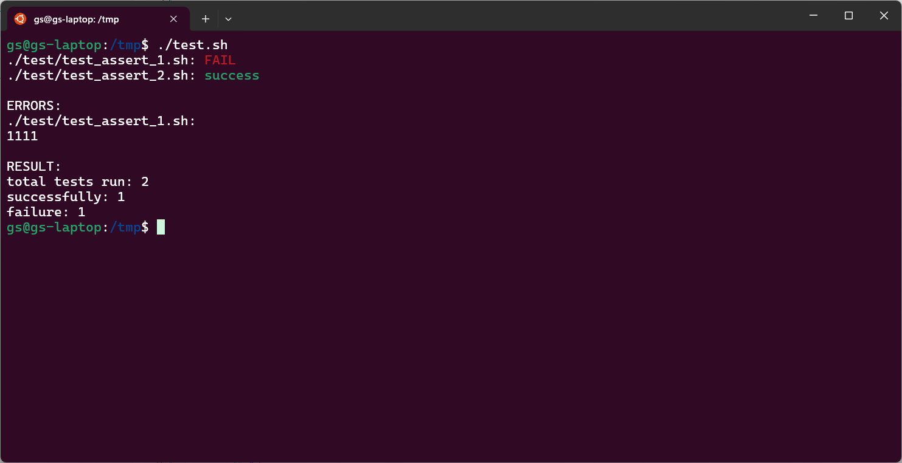

# Пишем библиотеку для тестирования shell-скриптов


Создадим главный файл который будет запускать все тесты:

```shell
$ touch test.sh
$ mkdir test
$ touch test/test_assert_1.sh
$ touch test/test_assert_2.sh
```

Так же создадим поддиректорию в которой разместим файлы с тестами. В итоге, структура директории будет такова:

```shell
$ tree ./
./
├── test
│   ├── test_assert_1.sh
│   └── test_assert_2.sh
└── test.sh

1 directory, 3 files
```

Файлы в которых будем писать тесты будут иметь префикс `test_` в названии и расширение `sh`. Это нужно для того чтобы не пытаться запустить всякие вспомогательные для тестов файлы.

Первое что нам нужно - найти все файлы с тестами в дирректории и поддиректориях:

```shell
#!/usr/bin/env bash

for i in $(find . -type f -name "test_*.sh");
do
    echo $i
done
```

Проверим:

```shell
$ ./test.sh
./test/test_assert_1.sh
./test/test_assert_2.sh
```

Отлично, список файлов у с тестами у нас есть.

Теперь попробуем запустить эти файлы:

```shell
for i in $(find . -type f -name "test_*.sh");
do
    scrip_dir=$(dirname $i)
	script_file=$(basename $i)
    (cd $scrip_dir && ./$script_file)
done
```

Как видно, предварительно делаем переход в каталог расположения файла. Сделано это для того, чтобы все инклуды отсчитывать от файла с тестом а не от запускающего его файла.


```shell
$ ./test.sh
./test.sh: 7: ./test_assert_1.sh: Permission denied
./test.sh: 7: ./test_assert_2.sh: Permission denied
```

Нет прав... А ну-ка проверим:

```shell
$ ls -l test
total 8
-rw-r--r-- 1 gs gs 18 Sep 19 16:09 test_assert_1.sh
-rw-r--r-- 1 gs gs 10 Sep 19 15:42 test_assert_2.sh
```

Ага, наши файлы не имеют флага запуска. Мы можем его им проставить, но тогда нам нужно будет на все файлы с тестами ставить этот флаг. Неудобно. Давайте, лучше, внутри нашего интерпретатора запустим ещё один и скажем ему исполнить эти файлы:

```diff
7c7
<     (cd $scrip_dir && ./$script_file)
---
>     (cd $scrip_dir && bash ./$script_file)
9d8
< 
```

Предварительно напишем в эти файлы чего-нибудь:

```shell
$ echo "echo 111" > test/test_assert_1.sh
$ echo "echo 222" > test/test_assert_2.sh
```

А теперь запустим:

```shell
$ ./test.sh
111
222
```

Теперь, хорошо бы указывать успешно у нас прошёл тест или нет. Код возврата последней операции можно получить через `$?`. Добавим проверку кода возврата и вывод уведомления об успешности теста:

```diff
7a8,13
>     if [ $? -ne 0 ];
>     then
>         echo "$i: FAIL"
>     else
>         echo "$i: success"
>     fi
```

А в один из файлов добавим код возврата неудачи:

```shell
$ echo "exit 1" >> test/test_assert_1.sh
```

Теперь запустим наш тест:

```shell
$ ./test.sh
111
./test/test_assert_1.sh: FAIL
222
./test/test_assert_2.sh: success
```

Как видим, у нас выполнились оба теста несмотря на то, что первый тест должен был бы прекратить выполнение скрипта вызовом `exit 1` но это не произошло потому что его мы запустили в отдельном интерпретаторе (`bash ./$script_file`).

Что ж, теперь бы хотелось сделать так чтобы выводы тестов были ниже списка результатов запуска чтобы не мешать всё в одну кучу:

```diff
2a3,6
> SUCCESS_COUNTER=0
> FAIL_COUNTER=0
> TEST_FILE_COUNTER=0
>
5a10,11
>     TEST_FILE_COUNTER=$(( TEST_FILE_COUNTER + 1 ))
>
14c20,21
<         echo "$i: FAIL"
---
>         FAIL_COUNTER=$(( FAIL_COUNTER + 1 ))
>         echo -e "$i: FAIL"
16c23,24
<         echo "$i: success"
---
>         SUCCESS_COUNTER=$(( SUCCESS_COUNTER + 1 ))
>         echo -e "$i: success"
25a34,38
>
> echo "RESULT:"
> echo "total: $TEST_FILE_COUNTER"
> echo "successfully: $SUCCESS_COUNTER"
> echo "failure: $FAIL_COUNTER"
```

Посмотрим результат:

```shell
$ ./test.sh
./test/test_assert_1.sh: FAIL
./test/test_assert_2.sh: success

ERRORS:
./test/test_assert_1.sh:
1111

RESULT:
total: 2
successfully: 1
failure: 1
```

Отлично!

Осталось только добавить фильтр позволяющий запускать только определённые файлы
чтобы, при необходимости, не гнать все тесты:

```diff
2a3,4
> TEST_FILE_FILTER=$@
>
9a12,25
>       if [ "$TEST_FILE_FILTER" != "" ]; then
>               IS_ACCEPT=0
>               for filter in $TEST_FILE_FILTER; do
>                       if [[ "$i" =~ $filter ]]; then
>                               IS_ACCEPT=1
>                               break
>                       fi
>               done
>
>               if [ "$IS_ACCEPT" -eq 0 ]; then
>                       continue
>               fi
>       fi
>
```

Запускаем:

```shell
$ ./test.sh assert_[2-9]
./test/test_assert_2.sh: success

ERRORS:
RESULT:
total tests run: 1
successfully: 1
failure: 0
```

Как видно, мы можем писать тут регулярные выражения. Есть только одна проблема:

```shell
$ ./test.sh some_string

ERRORS:
RESULT:
total tests run: 0
successfully: 0
failure: 0
```

У нас показывается строка `ERRORS:`, чего быть не должно. Добавим проверку списка ошибок:

```diff
44,47c44
< echo
< echo "ERRORS:"
< for i in "${!FAIL_OUTPUT[@]}"; do
<       echo -e "${i}:\n${FAIL_OUTPUT[$i]}"
---
> if [ ${#FAIL_OUTPUT[@]} -gt 0 ]; then
49c46,51
< done
---
>       echo "ERRORS:"
>       for i in "${!FAIL_OUTPUT[@]}"; do
>               echo -e "${i}:\n${FAIL_OUTPUT[$i]}"
>               echo
>       done
> fi
```

Теперь всё хорошо:

```shell
$ ./test.sh some_string
RESULT:
total tests run: 0
successfully: 0
failure: 0
```

Что ж, теперь, я думаю, можно навести немного лоска. Добавим цвета в вывод:

```diff
4a5,8
> COLOR_FAIL='\033[0;31m' # Red
> COLOR_SUCCESS='\033[0;32m' # Green
> COLOR_NC='\033[0m' # No Color
>
37c41
<         echo -e "$i: FAIL"
---
>         echo -e "$i: ${COLOR_FAIL}FAIL${COLOR_NC}"
40c44
<         echo -e "$i: success"
---
>         echo -e "$i: ${COLOR_SUCCESS}success${COLOR_NC}"
```



## Вспомогательные функции

Почти всё готово! Остался только один момент - каждый раз сравнивать значения и если они не соответсвуют ожиданиям писать сообщение и делать выход немного утомительно. Т.е. у нас во всех тестах будет такая конструкция:

```shell
...
if [ ... ]; then
    echo "some error message"
    exit 1
fi
...
```

Добавим вспомогательную функцию `assert` которая будет испонять этот шаблонный код.

```shell
assert() {
    message=${3:-""}

    local diff_value
    set -o pipefail
    diff_value=$(diff  <(echo "$1" ) <(echo "$2") | sed -z 's/\n/\\n/g')

    if [ $? -ne 0 ];
    then
        echo -e "$message:\n$diff_value"
        exit 1
    fi
}
```

Она принимате три параметра: первые два - сравниваемые значения, третий - сообщение об ошибке, он не обязателен.

Вызывается так:

```shell
assert 10 $a "Кол-во чего-то там должно быть 10"
```

Стоит пояснить эти две строки:

```shell
set -o pipefail
diff_value=$(diff  <(echo "$1" ) <(echo "$2") | sed -z 's/\n/\\n/g')
```

`set -o pipefail` делает так, что мы получаем последний ненулевой код завершения в конвеере, иначе, если команда `diff` вернёт `1` следующая за ней команда `sed` вернёт `0` и мы никогда не узнаем что значения у нас отличаются: условие `if [ $? -ne 0 ];` никогда не сработает.

Ок, функция у нас есть. Но куда её поместить? Если поместить её в файл `test.sh` то она будет не доступна в скриптах с тестами потому как они запускаются в отдельном интерпретаторе. Остаётся только поместить её в отдельный файл. Так и поступим:

```shell
$ touch utils.sh
```

Теперь структура директорий следующая:

```shell
$ tree ./
./
├── test
│   ├── test_assert_1.sh
│   └── test_assert_2.sh
├── test.sh
└── utils.sh
1 directory, 4 files
```

Но, совершенно нет никакого желания в каждый тестовый файл подключать наш файл с утилитами. Тогда подгрузим его в shell который исполняет тест!

```diff
4a5,6
> CURR_DIR=$(pwd)
> 
34c36
<     out=$(cd $scrip_dir && bash ./$script_file)
---
>     out=$(cd $scrip_dir && bash --noprofile --norc -c "source $CURR_DIR/utils.sh; source ./$script_file")
```

Перепишем наши тесты так чтобы они использовали эту утилиту.

```shell
$ echo "assert 1 2 \"1 не равно 2\"" > test/test_assert_1.sh
$ echo "assert 2 2 \"2 не равно 2\"" > test/test_assert_2.sh
```

Запускаем:

```shell
$ ./test.sh
./test/test_assert_1.sh: FAIL
./test/test_assert_2.sh: success

ERRORS:
./test/test_assert_1.sh:
1 не равно 2:
1c1
< 1
---
> 2

RESULT:
total tests run: 2
successfully: 1
failure: 1
```

Добавим в каждый из тестов ещё по вызову `assert` и посмотрим что будет.

```shell
$ echo "assert 3 3 \"3 не равно 3\"" >> test/test_assert_1.sh
$ echo "assert 3 4 \"3 не равно 4\"" >> test/test_assert_2.sh
$ ./test.sh
./test/test_assert_1.sh: FAIL
./test/test_assert_2.sh: FAIL

ERRORS:
./test/test_assert_2.sh:
3 не равно 4:
1c1
< 3
---
> 4

./test/test_assert_1.sh:
1 не равно 2:
1c1
< 1
---
> 2

RESULT:
total tests run: 2
successfully: 0
failure: 2
```

Тут мы видим две вещи:

1. Если сравнение в `assert` не было пройдено то тест на этом завершается, иначе его выполнение продолжится
1. Сообщения об ошибках выводятся в обратном порядке

Если первый пункт нас полностью устраивает то со вторым надо что-то делать.

```diff
56c56
<       done
---
>       done | tac
```

```shell
$ ./test.sh
./test/test_assert_1.sh: FAIL
./test/test_assert_2.sh: FAIL

ERRORS:

> 2
---
< 1
1c1
1 не равно 2:
./test/test_assert_1.sh:

> 4
---
< 3
1c1
3 не равно 4:
./test/test_assert_2.sh:
RESULT:
total tests run: 2
successfully: 0
failure: 2
```

Ну, почти то что и требовалось, нужно только немного доработать напильником. 

Проблема в том, что у `tac` смотрит на символ перехода на новую строку, значит нужно сначала все символы заменить на какой-то другой символ, чтобы для каждого сообщения об ошибке было только одна строка, а затем всё вернуть как было:

```diff
54c54
<               echo -e "${i}:\n${FAIL_OUTPUT[$i]}"
---
>               echo -e "${i}:\n${FAIL_OUTPUT[$i]}" | sed -z 's/\n/\\n/g' 
56c56
<       done | tac
---
>       done | tac | sed 's/\\n/\n/g'
```

Ну, такое себе, но пока что пойдёт. Проверим:

```shell
$ ./test.sh
./test/test_assert_1.sh: FAIL
./test/test_assert_2.sh: FAIL

ERRORS:
./test/test_assert_1.sh:
1 не равно 2:
1c1
< 1
---
> 2

./test/test_assert_2.sh:
3 не равно 4:
1c1
< 3
---
> 4

RESULT:
total tests run: 2
successfully: 0
failure: 2
```

Что ж, кажется, на этом, пока что, можно остановится.

## Резюме

Итак. Сейчас мы имеет минимальную среду для тестирования скриптов на bash, котора может:

- запускать как все скрипты так и соответствующие шаблону
- отмечает упавшие и прошедшие успешно тесты
- показывает статистику по тестам
- показывает ошибки в тестах

Полный код можно посмотреть в этом [репозитории](https://github.com/4irik/bashunit).

### TODO

Следовало бы добавить:

- показ номера строки в тестовом файле на которой произошла ошибка
- флаг `--dry-run`
- флаг `--fast-fail`
- функции определяющие неравенство (`greaterThen`, `lessThen`, ..)

В порядке бреда (а почему бы и не "да"?):

- [dataProvider](https://docs.phpunit.de/en/11.3/writing-tests-for-phpunit.html#data-providers) (?!)
- моки/стабы (?!)
- setup/teardown для файла/для всего тестового набора
- параллельное выполнение тестов (?!)

---

- [Issue](https://github.com/4irik/log/issues/2) для комментариев.
- [Анонс](https://t.me/stdi0_h/31) в телеграм-канале.
