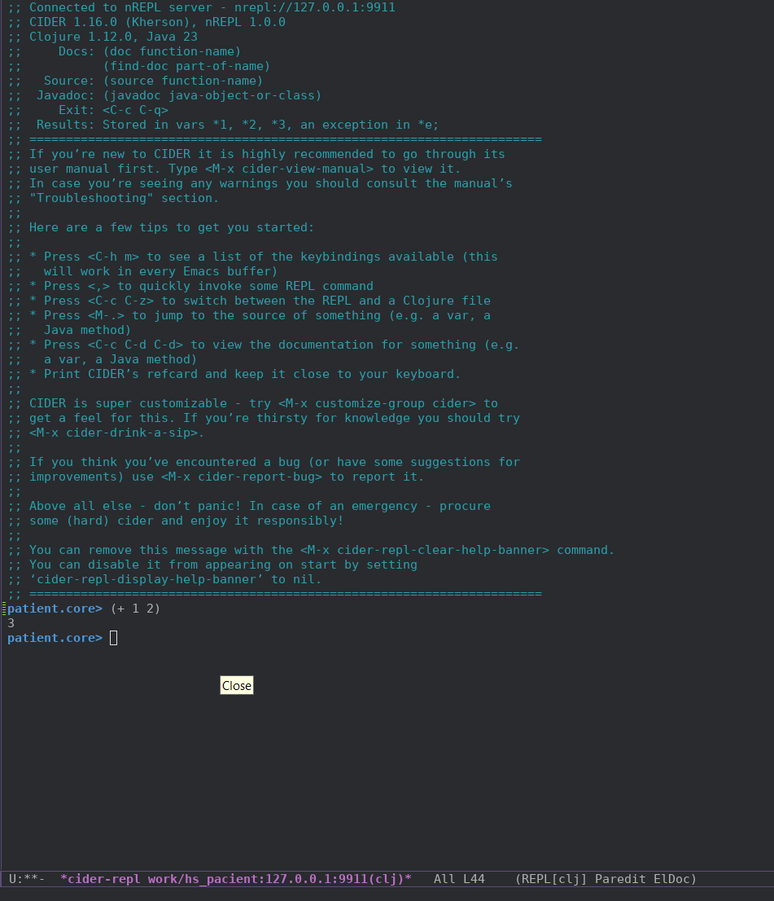

# Пишем простое web-CRUD-приложение на Clojure

## Требования к ПП

 Реализовать CRUD пациента.

**Dataset:**

- ФИО пациента
- Пол
- Дата рождения
- Адрес
- Номер полиса ОМС

### Функционал

- [ ] просмотр списка пациентов
- [ ] поиск
- [ ] фильтрация
- [ ] создание
- [ ] удаление
- [ ] редактирование
- [ ] валидация

### Дополнительно

- без фреймворков
- использовать vim/emacs
- пишем тесты
- REPL-driven разработка
- CI
- подготовить продукт к развёртыванию в K8s
- в качестве СУБД PgSql

<!-- - в демо отразить:
  - как разрабатывал через repl
  - обосновать принятие ключевых решений -->

## Подготовка

### Инфраструктура

Будем, как всегда, работать через Docker. Т.к. у нас, кроме самой Clojure есть ещё и СУБД, то используем `docker compose`. 

Посмотрим есть ли что среди Docker-образов. Есть, образ даже официальный - https://hub.docker.com/_/clojure. Читаем: 

> 1. leiningen⁠
>    1. The oldest and probably most common tool

этот подходит, берём последнюю версию. Сразу же берём и pgsql:

```yml
services:
    app:
        image: clojure:temurin-23-lein-alpine
        restart: always
        working_dir: /app
        volumes:
            - ./:/app
    db:
        image: postgres:17.0-alpine3.20
        restart: always
        # set shared memory limit when using docker-compose
        shm_size: 128mb
        # or set shared memory limit when deploy via swarm stack
        #volumes:
        #  - type: tmpfs
        #    target: /dev/shm
        #    tmpfs:
        #      size: 134217728 # 128*2^20 bytes = 128Mb
        ports:
            - 5432:5432
        environment:
            POSTGRES_PASSWORD: pswd
            POSTGRES_DB: patient_db
            PGDATA: ./pgdata

```

~~! Почему temurin?~~

Тут же накидаем `Makefile`:

```make
help: ## Show this help
	@printf "\033[33m%s:\033[0m\n" 'Available commands'
	@awk 'BEGIN {FS = ":.*?## "} /^[a-zA-Z0-9_-]+:.*?## / {printf "  \033[32m%-18s\033[0m %s\n", $$1, $$2}' $(MAKEFILE_LIST)

build: ## Build containers
	docker compose build

up: ## Run application
	docker compose up -d

down: ## Down application
	docker compose down

restart: down up ## Restart application

shell: ## Shell at clojure docker
	docker compose exec app bash

log: ## Show container logs
	docker compose logs -f
```

### Первые шаги

Т.к. в Clojure я новичок, то потребовалось некоторое время чтобы понять что `lein` - это [leiningen](https://leiningen.org/), сборщик проекта а не какая-то специфическая версия кложи. Поначалу я искал в docker-образе что-то вроде `clojure` и `clj` и не мог найти, потом всё встало на свои места.

Заходим в docker-образ и создаём каркас приложения:

```shell
$ make start && make shell
$ lein new patient
```

получилось что-то вроде этого:

```shell
$ tree
.
├── CHANGELOG.md
├── LICENSE
├── Makefile
├── README.md
├── doc
│   └── intro.md
├── docker-compose.yml
├── project.clj
├── resources
├── src
│   └── patient
│       ├── core.clj
├── target
│   ├── classes
│   │   └── META-INF
│   │       └── maven
│   │           └── patient
│   │               └── patient
│   │                   └── pom.properties
│   ├── repl-port
│   └── stale
│       └── leiningen.core.classpath.extract-native-dependencies
└── test
    └── patient
        └── core_test.clj

14 directories, 14 files
```

У нас есть тесты, попробуем их запустить:

```shell
$ lein test

lein test patient.core-test

lein test :only patient.core-test/a-test

FAIL in (a-test) (core_test.clj:7)
FIXME, I fail.
expected: (= 0 1)
  actual: (not (= 0 1))

Ran 1 tests containing 1 assertions.
1 failures, 0 errors.
Subprocess failed (exit code: 1)
```

Хорошо, что-то уже работает. Добавим запуск тестов в `Makefile`:

```Makefile
test: ## Run app tests
	docker compose exec app lein test
```

Заглянем в файл `core.clj`:

```clj
(ns patient.core)

(defn foo
"I don't do a whole lot."
  [x]
  (println x "Hello, World!"))
```

Для того чтобы у нас что-то скомпилировалось надо добавить функцию `-main`:

```clj
(ns patient.core)

(defn -main
  [& args]
  (println "Hello, World!"))

(defn foo
;; ...
```

Теперь попробуем это всё собрать и запустить:

```shell
$ lein run -m patient.core
Hello, World!
```

Добавляем команду запуска в `Makefile`:

```Makefile
run: ## Run application
	docker compose exec app lein run -m patient.core
```

### Редактор

У меня уже стоял Emacs и даже был немного преднастроен. Уже не помню для чего. Укажу часть `init.el` относящуюся к этому проекту:

```lisp
(use-package cider
  :ensure t)

(use-package clojure-mode
  :ensure t)
```

Хорошо бы добавить REPL. Нагуглил эту статью - https://grishaev.me/clj-repl-part-4/#nrepl-в-docker. Делаем по ней:

*project.clj:*
```clj
(defproject patient "0.1.0-SNAPSHOT"
  ;; ...
  :profiles
  {:docker
	{:repl-options {:port 9911
		        :host "0.0.0.0"}
	:plugins [[cider/cider-nrepl "0.50.2"]]}})
```


*docker-compose.yml:*
```yml
services:
    app:
        command: ["lein", "with-profile", "+docker", "repl", ":headless"]
```

Перезапускаем наш docker-образ и пытаемся присоединиться в emacs:

```
M-x cider-connect RET 127.0.0.1 RET 9911 RET
```


Отлично! Хорошо бы ещё не вводить эту строчку каждый раз когда нужен `REPL`, но этим займёмся потом. 

## Реализация

Собственно, т.к. писать я всё собрался на Clojure и ClojureScript, то, легче будет если решать задачи постепенно. Пока я ещё не знаю ни как писать фронт ни как писать бэк. Хочу начать с бэка, т.к. он мне более понятен (да и не будет ничего работать без него :D). 

Если поискать как можно на Clojure сделать web-сервис то можно найти и [примеры](https://github.com/chris-emerson/rest_demo) (к которым хорошо бы ещё иметь описание того что там и зачем) реализации и [библиотеки](https://github.com/metosin/reitit) которые многое на себя берут.

Мне хотелось бы собрать всё самому, так что в примеры я буду подглядывать а библиотеки, которые уже всё могут, использовать не буду, что бы, так сказать, лучше прочувствовать каково это.

### Backend

#### Minimal app

Недолгий поиск привёл меня на страничку ["Введение в веб-разработку на Clojure"](https://grishaev.me/clj-book-web-1/). В прошлый раз [статья](https://grishaev.me/clj-repl-part-1/) этого автора мне уже помогла когда я делал для своего [REPL'а](https://github.com/4irik/lisphp) многострочный ввод (собственно и саму идею его сделать я оттуда почерпнул). Бегло прочитав статью решил что буду следовать ей.

Напишем начальную реализацию приложения:

*core.clj:*
```clj
;; ...

(defn app
  [request]
  (let [{:keys [uri request-method]} request]
    {:status 200
     :headers {"Content-Type" "text/plain"}
     :body (format "You requested %s %s"
                   (name request-method)
                   uri)}))
```

Чтобы проверить как эта функция работает нужно её скомпилировать, для этого ставлю курсор на последнюю скобку и нажимаю `C-x C-e`, затем перехожу в `REPL` (`C-c C-z`) и вызываем её:

```clj
patient.core> (app {:request-method :get :uri "/index.html"})
```

в ответ видим: 

```clj
{:status 200,
 :headers {"Content-Type" "text/plain"},
 :body "You requested get /index.html"}
```

Всё работает. Двигаемся дальше.

#### Web-сервер

Добавим в зависимости два пакета:

*project.clj:*
```clj
;; ...
:dependencies [[org.clojure/clojure "1.12.0"]
               ;; base web-app
               [ring/ring-core "1.12.2"]
               ;; web-server
               [ring/ring-jetty-adapter "1.12.2"]
               ]
```

Чтобы их скачать нужно запустить `lein deps`. Добавим сразу эту команду в `Makefile`:

```Makefile
deps: ## Upload dependencies
	docker compose exec app lein deps
```

Сделаем так, чтобы сервер стартовал при запуске нашего приложения через `lein`.

*core.clj:*
```clj
;; ...

(require '[ring.adapter.jetty :refer [run-jetty]])

;; ...

(defn -main
  [& args]
    (def server (run-jetty app {:port 8080 :join? false}))
  )
```

прокинем порт `8080` из докера во вне:

*docker-compose.yml:*
```yml
services:
    app:
        # ...      
        ports:
            - 9911:9911
            - 8080:8080
```

и запустим наше приложение:

```shell
$ make restart && make run
Retrieving org/apache/commons/commons-parent/52/commons-parent-52.pom from central
Retrieving org/eclipse/jetty/jetty-project/11.0.21/jetty-project-11.0.21.pom from central
Retrieving com/fasterxml/jackson/jackson-bom/2.17.0/jackson-bom-2.17.0.pom from central
...
SLF4J: No SLF4J providers were found.
SLF4J: Defaulting to no-operation (NOP) logger implementation
SLF4J: See https://www.slf4j.org/codes.html#noProviders for further details.
```

Ошибок нет, и если зайти на `http://127.0.0.1:8080` то увидим:

```text
You requested get /
```

Всё работает, но сейчас, т.к. я сижу с мобильного интернета, мне более важно другое: идёт скачивание всякого, скачивается всякое, естественно, в директорию внутри docker-образа, изменения в которой не сохраняются между запусками. Так мы каждый раз будем всё скачивать. Надо что-то делать. Всё в [той же статье](https://grishaev.me/clj-repl-part-4/#nrepl-в-docker) есть целых два решения:

1. прокинуть `/root/.m2` во вне
2. в профиль `:docker` добавить параметр `:local-repo`

Если пойти по второму пути то нужно будет всё и всегда запускать с указанием этого профиля, иначе всё что будет скачиваться будет скачиваться внутрь docker-контейнера. Первый же путь избавляет от необходимости помнить о параметрах запуска чего бы то ни было. Выбираем его.

*docker-compose.yml:*
```yml
services:
    app:
        # ...
        volumes:
            - ./:/app
            - ./.m2:/root/.m2
```
