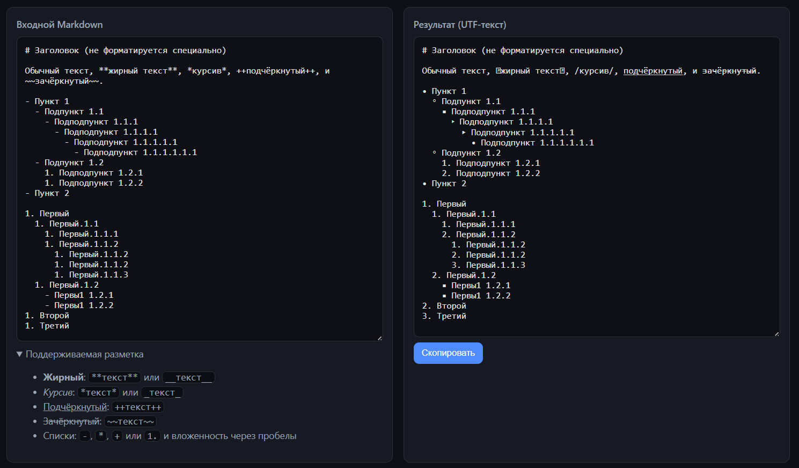

# Написание заметок для LinkedIn в Markdown. Вайбкодим свой преобразователь форматов в Cursor. 

_Это просто очерк о том как, бывает, быстро можно сделать что-то удобоваримое не особо разбираясь в том как оно работает._



Т.к. в  LinkedIn нет форматирования, а хочется, как минимум чтобы были списки:

 1. нумерованный;
 1. маркированный;
 1. учёт вложенности;

а так же различные начертания текста:

 - **жирный**;
 - *курсив*;
 - _подчёркнутый_;
 - ~~зачёркнутый~~;
 - комбинации вышеперечисленного;

И я хочу всё писать в markdown. 

Т.к. форматирования (кроме пробелов) в заметках не предусмотрено, то начертания надо делать через вставку utf-символов. Со списками, конечно, всё куда как проще, нужен только литерал для обозначения элемента списка и пробелы для учёта вложенности.

Собственно примерно такой текст я и закинул в Cursor, финальный (на текущий момент) результат видно на картинке.

Проблем было две: 
 - для маркированного списка, элементы первого уровня вместо маркера имели надпись `undefined`;
 - в нумерованном же списоке, для элементов, опять же, первого уровня значение маркера (циферка то есть) не возрастала, притом для вложенных элементов всё работало.

Первую ошибку он поправил с первого раза. Для работы над второй он создал файл `test.js` в котором была копипаста с основного скрипта плюс тестовая функция которая подавала на вход функции форматирования:

```txt
1. Первый
1. Второй
1. Третий
```
и сравнивала её вывод с ожиданием:

```txt
1. Первый
2. Второй
3. Третий
```

Далее он попросил у меня разрешения запустить nodejs и по кругу запускал свой тестовый код и правил его, запускал и правил. Я принципиально не вмешивался. В какой-то момент мне начало казаться что он ходит по кругу из которого уже никогда не выбертся. И вот, когда он сжёг уже 30% от бюджета токенов, его вдруг осенило и он справился!

Из приятных моментов:
- он сам перенёс правки в основной скрипт;
- я сказал ему что nodejs у меня нет, но он может использовать docker, и он тут же сформировал команду для запуска своих тестов в докер-образе с нодой с пробросом всех необходимых ему файлов;
- он сразу сделал приятный web-интерфейс и добавил кнопку "Скопировать" (с одной стороны я его об этом не просил, с другой стороны это то что мне было нужно).

А далее, так как начертания символов - это уже подстановка похожих по начертания символов из UTF, и:
- искаться обычным поиском эти строки не будут
- в сети пишут что LI посты с такими подставновками понижает в выдаче

я решил что форматирования списков мне вполне достаточно на текущее время. Позже, может быть, докручу ещё проверку картинок (у LI есть требования по размеру и формату) и сделаю превью поста.

PS. Меня только, после всего этого, мучает один вопрос - "А кто автор кода то теперь?". 🤔