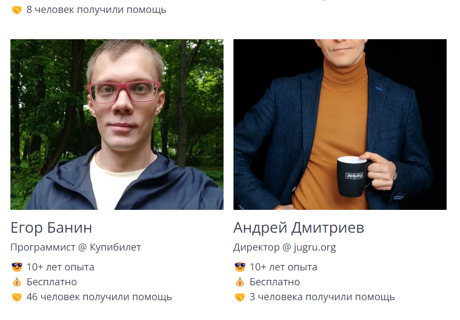
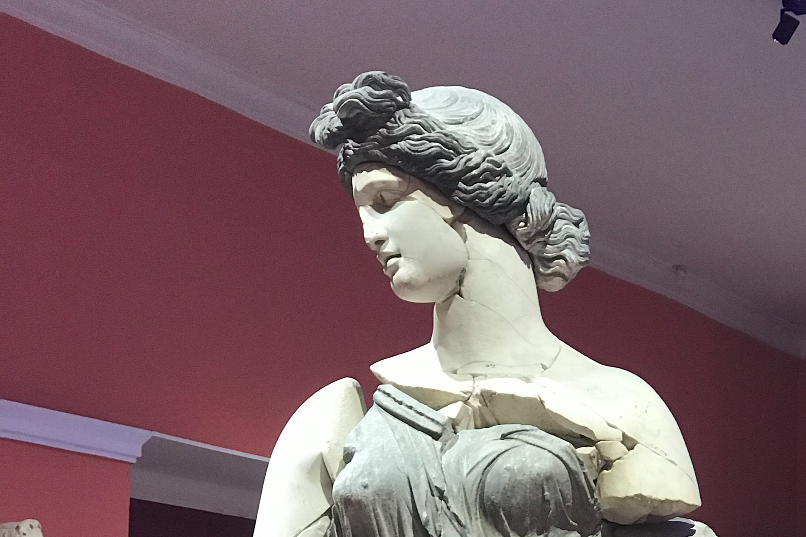
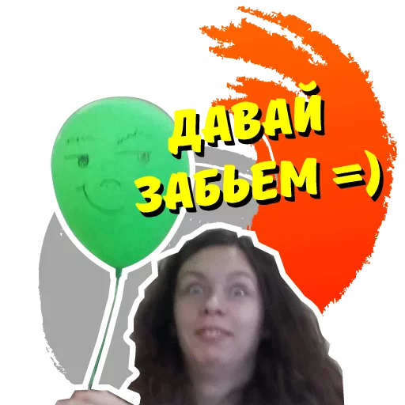
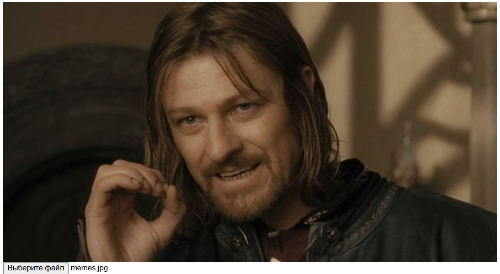
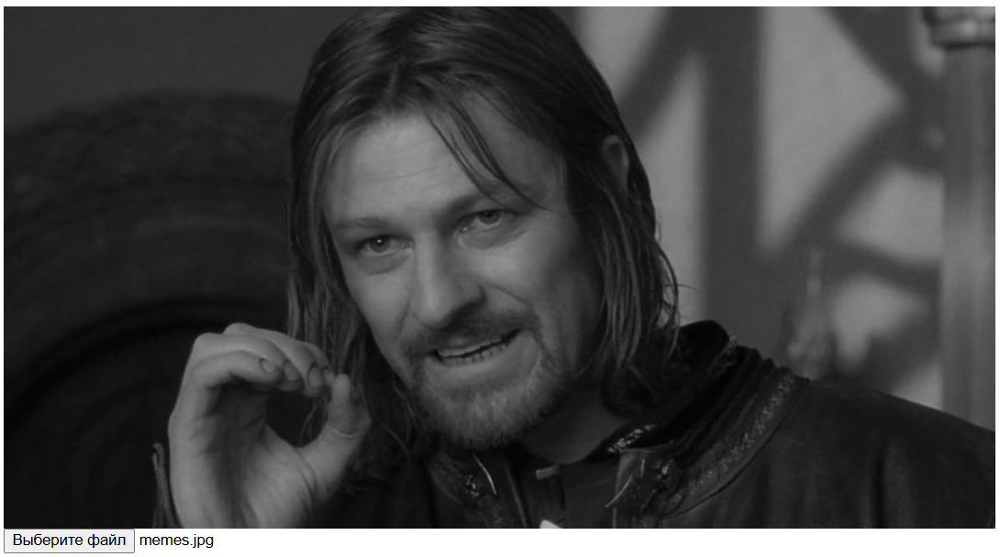
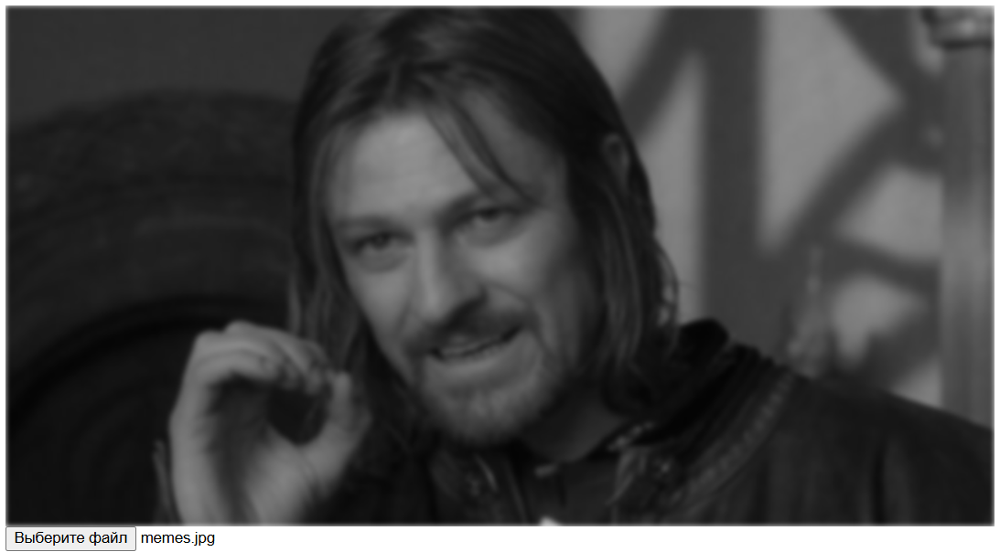
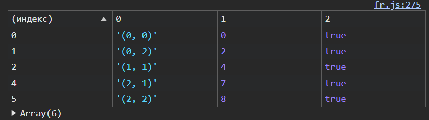

# Простой поиск лица на фотографии

## Пролог

Зашёл я тут на сайт [getmentor](https://getmentor.dev), если честно, сам не знаю зачем. Но, увидел я там следующее:



Пу-пу-пу... Да как же это возможно? И это в век, когда ~~космическим корабли~~ нейронные сети бороздят Большой Театр!

Так, а что мы можем тут сделать? Ну, если убрать в сторону нейронные сети, opencv и прочее? Первая мысль - погуглить!

Так. Алгоритм Виолы-Джонса, признаки Хаара... Хм... 

Вторая мысль - эвристика! Например такая:

1. найти овал на изображении
1. внутри овала найти ещё два овала поменьше
1. между маленькими овалами вертикальная черта
1. под вертикальной чертой горизонтальная черта

Хм... это будет работать если фото анфас, а если это профиль (встречал и такие фото)?



Тут овалом и не пахнет. Проблема... Но решение есть!



*Женя прости ))*

Итак. Решено, работаем только с фото анфас *(иначе я никогда не напишу эту статью)*. Так же хочется сразу видеть результат, это значит, в моём случае, что будем писать на JS. 

Приступим.

## Реализация

### Загрузка изображения и первичная обработка

Шаг первый - загрузить фото и отобразить его на `canvas` (потому что нам надо делать преобразования с фото):

```html
<html>
    <head>
        <title>JS face recognition</title>
        <script src="fr.js" defer></script>
    </head>
    <body>
        <canvas id="canvas"></canvas>
        <input type="file" accept="image/*">
    </body>
</html>
```

```js
const cv = document.getElementById('canvas');
const ctx = cv.getContext('2d', {willReadFrequently: true});

document.getElementsByTagName('input')[0].addEventListener('change', (e) => {
    const img = new Image();
    img.onload = () => {
        cv.width = img.width;
        cv.height = img.height;
        ctx.clearRect(0, 0, cv.width, cv.height);
        ctx.drawImage(img, 0, 0);
    }

    const fileReader = new FileReader();
    fileReader.onload = (event) => {
        img.src = event.target.result;
    }
    fileReader.readAsDataURL(e.target.files[0]);
})
```
Проверим, как работает загрузка и отображение фото:



Так. Теперь бы избавиться от цвета, он нам особо то и не нужен:

```diff
***************
*** 8,13 ****
--- 8,17 ----
          cv.height = img.height;
          ctx.clearRect(0, 0, cv.width, cv.height);
          ctx.drawImage(img, 0, 0);
+         let imageData = ctx.getImageData(0, 0, cv.width, cv.height);
+         const dst = new Uint32Array(imageData.data.buffer);
+         desaturate(dst);
+         ctx.putImageData(imageData, 0, 0);
      }
  
      const fileReader = new FileReader();
***************
*** 16,18 ****
--- 20,34 ----
      }
      fileReader.readAsDataURL(e.target.files[0]);
  })
+ 
+ const desaturate = src => {
+     for (let i = 0; i < src.length; i++) {
+         let r = src[i] & 0xFF;
+         let g = (src[i] >> 8) & 0xFF;
+         let b = (src[i] >> 16) & 0xFF;
+         let gray = (r + g + b) / 3;
+         src[i] = 0xFF000000 | (gray << 16) | (gray << 8) | gray;
+     }
+ 
+     return src;
+ }
```

*реализация функции `desaturate` взята [отсюда](https://annimon.com/article/3623), а коэффициенты взял [тут](https://digitalbunker.dev/how-does-edge-detection-work/).*

> [!NOTE]
> Позже я нашёл более простой способ - фильтры:
> ```diff
> ***************
> *** 7,12 ****
> --- 7,13 ----
>           cv.width = img.width;
>           cv.height = img.height;
>           ctx.clearRect(0, 0, cv.width, cv.height);
> +         ctx.filter = 'grayscale(1)';
>           ctx.drawImage(img, 0, 0);
>       }
> ```

Окай, смотрим:




### Выделение границ

Поиск привёл меня [сюда](https://habr.com/ru/articles/114452/) (вот раньше хабр был торт, да), оператор Собеля мне подходит. 

Но тут я наткнулся на такой видос - https://youtu.be/uihBwtPIBxM?si=lulRCVIXpy-IPiI5 (спасибо яндекс-браузеру с его функцией перевода видео!). В самом конце, где-то в начале седьмой минуты, говорится что этот метод очень чувствителен к шумам, и рекомендуется сначала примерить размытие по Гауссу. 

```diff
***************
*** 7,12 ****
--- 7,13 ----
          cv.width = img.width;
          cv.height = img.height;
          ctx.clearRect(0, 0, cv.width, cv.height);
+         ctx.filter = 'grayscale(1) blur(2px)';
          ctx.drawImage(img, 0, 0);
      }
```



> [!NOTE]
> Значение `blur(2px)` я подобрал опытным путём. Кажется,
> что оно должно быть разным для фото разного размера, но,
> т.к. делаем мы это всё под конкретный случай, 
> то не будем заморачиваться.


<!-- Опять идём в гугл. Находим такое - https://aryamansharda.medium.com/image-filters-gaussian-blur-eb36db6781b1. Перепишем на JS, но сначала я хочу написать вспомогательную функцию чтобы каждый раз не вычислять на какое смещение нужно пододвинуть указатель чтобы попасть ровно строкой ниже (`imageData.data` возвращает нам одномерный массив, а хотелось бы, для наглядности, работать с двумерным).

```js
const matrix2flat = width => 
    (x, y) => {
        if (x*y > Math.pow(width-1, 2)) {
            throw new Error(`x (${x}) and y (${y}) do not grows then with (${width-1})`);
        }
        return x * width + y
    };
```

Тут же проверим:

```js
let a = [
    0, 2, 4,
    6 ,8 ,10,
    12, 14, 16
];
let m_2_f = matrix2flat(Math.sqrt(a.length));
console.table([
    ["(0, 0)", m_2_f(0,0), 0 == a[m_2_f(0, 0)]],
    ["(0, 2)", m_2_f(0,2), 4 == a[m_2_f(0, 2)]],
    ["(1, 1)", m_2_f(1,1), 8 == a[m_2_f(1, 1)]],,
    ["(2, 1)", m_2_f(2,1), 14 == a[m_2_f(2, 1)]],
    ["(2, 2)", m_2_f(2,2), 16 == a[m_2_f(2, 2)]],
]);
```


 -->
