# Простой поиск лица на фотографии

## Пролог

Зашёл я тут на сайт [getmentor](https://getmentor.dev), если честно, сам не знаю зачем. Но, увидел я там следующее:

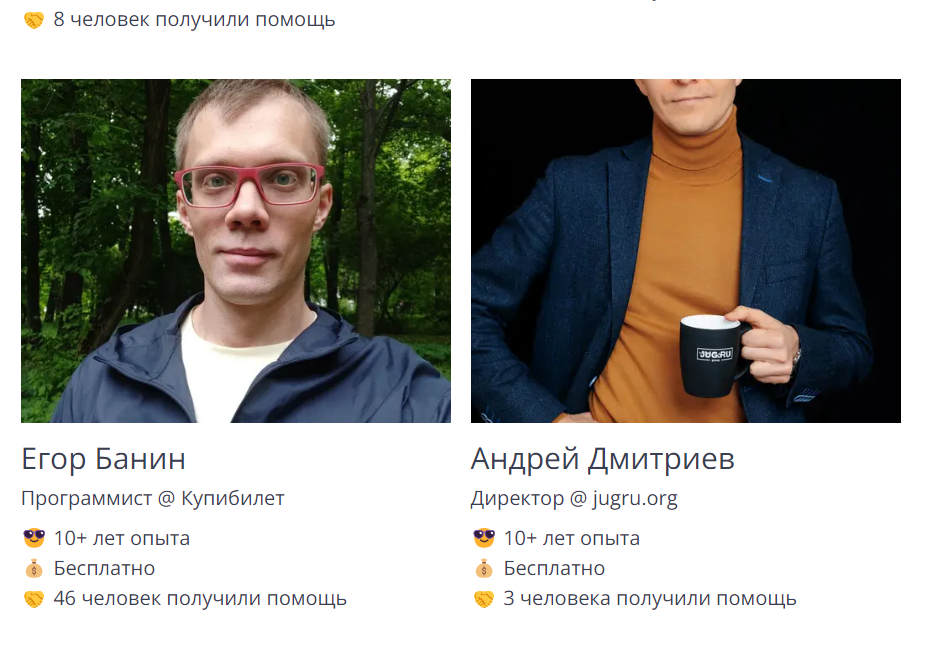

Пу-пу-пу... Да как же это возможно? И это в век, когда ~~космическим корабли~~ нейронные сети бороздят Большой Театр!

Так, а что мы можем тут сделать? Ну, если убрать в сторону нейронные сети, opencv и прочее? Первая мысль - погуглить!

Так. Алгоритм Виолы-Джонса, признаки Хаара... Хм... 

Вторая мысль - эвристика! Например такая:

1. найти овал на изображении
1. внутри овала найти ещё два овала поменьше
1. между маленькими овалами вертикальная черта
1. под вертикальной чертой горизонтальная черта

Хм... это будет работать если фото анфас, а если это профиль (встречал и такие фото)?

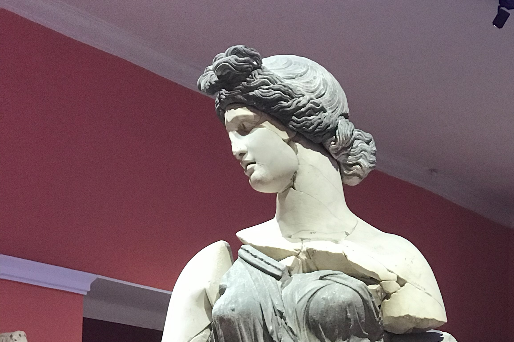

Тут овалом и не пахнет. Проблема... Но решение есть!

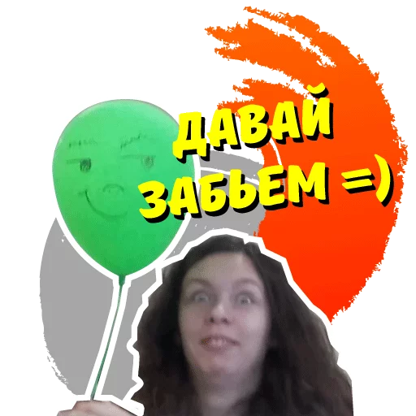

*Женя прости ))*

Итак. Решено, работаем только с фото анфас *(иначе я никогда не напишу эту статью)*. Так же хочется сразу видеть результат, это значит, в моём случае, что будем писать на JS. 

Приступим.

## Реализация

### Загрузка изображения и первичная обработка

Шаг первый - загрузить фото и отобразить его на `canvas` (потому что нам надо делать преобразования с фото):

```html
<html>
    <head>
        <title>JS face recognition</title>
        <script src="fr.js" defer></script>
    </head>
    <body>
        <canvas id="canvas"></canvas>
        <input type="file" accept="image/*">
    </body>
</html>
```

```js
const cv = document.getElementById('canvas');
const ctx = cv.getContext('2d', {willReadFrequently: true});

document.getElementsByTagName('input')[0].addEventListener('change', (e) => {
    const img = new Image();
    img.onload = () => {
        cv.width = img.width;
        cv.height = img.height;
        ctx.clearRect(0, 0, cv.width, cv.height);
        ctx.drawImage(img, 0, 0);
    }

    const fileReader = new FileReader();
    fileReader.onload = (event) => {
        img.src = event.target.result;
    }
    fileReader.readAsDataURL(e.target.files[0]);
})
```
Проверим, как работает загрузка и отображение фото:

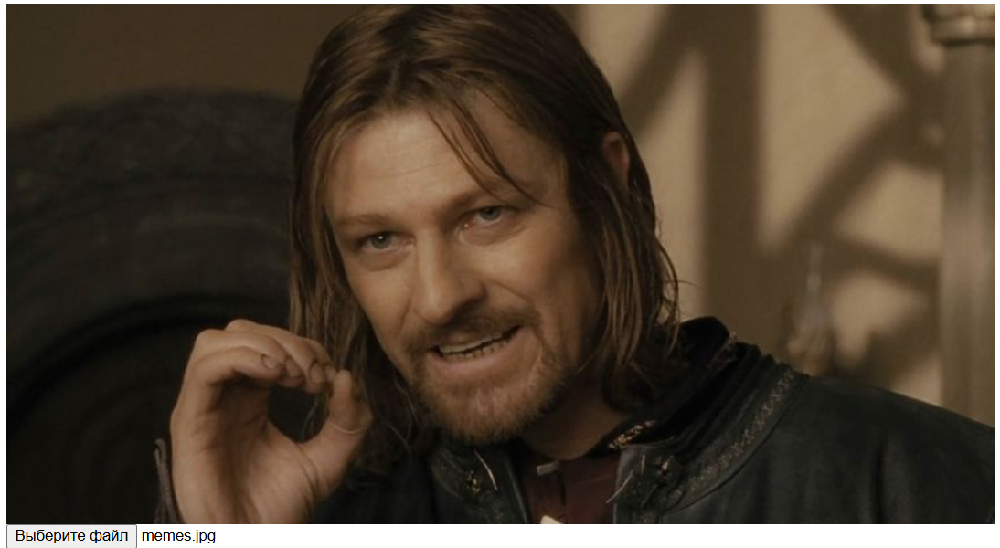

Так. Теперь бы избавиться от цвета, он нам особо то и не нужен:

```diff
***************
*** 8,13 ****
--- 8,17 ----
          cv.height = img.height;
          ctx.clearRect(0, 0, cv.width, cv.height);
          ctx.drawImage(img, 0, 0);
+         let imageData = ctx.getImageData(0, 0, cv.width, cv.height);
+         const dst = new Uint32Array(imageData.data.buffer);
+         desaturate(dst);
+         ctx.putImageData(imageData, 0, 0);
      }
  
      const fileReader = new FileReader();
***************
*** 16,18 ****
--- 20,34 ----
      }
      fileReader.readAsDataURL(e.target.files[0]);
  })
+ 
+ const desaturate = src => {
+     for (let i = 0; i < src.length; i++) {
+         let r = src[i] & 0xFF;
+         let g = (src[i] >> 8) & 0xFF;
+         let b = (src[i] >> 16) & 0xFF;
+         let gray = (r + g + b) / 3;
+         src[i] = 0xFF000000 | (gray << 16) | (gray << 8) | gray;
+     }
+ 
+     return src;
+ }
```

*реализация функции `desaturate` взята [отсюда](https://annimon.com/article/3623), а коэффициенты взял [тут](https://digitalbunker.dev/how-does-edge-detection-work/).*

> [!NOTE]
> Позже я нашёл более простой способ - фильтры:
> ```diff
> ***************
> *** 7,12 ****
> --- 7,13 ----
>           cv.width = img.width;
>           cv.height = img.height;
>           ctx.clearRect(0, 0, cv.width, cv.height);
> +         ctx.filter = 'grayscale(1)';
>           ctx.drawImage(img, 0, 0);
>       }
> ```

Окай, смотрим:

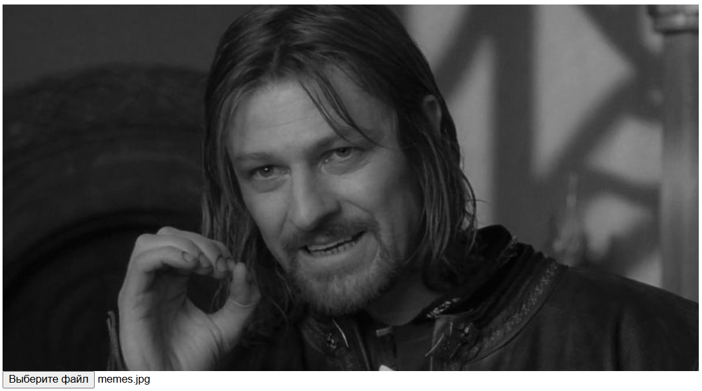


### Выделение границ

Поиск привёл меня [сюда](https://habr.com/ru/articles/114452/) (вот раньше хабр был торт, да), оператор Собеля мне подходит. 

Но тут я наткнулся на такой видос - https://youtu.be/uihBwtPIBxM?si=lulRCVIXpy-IPiI5 (спасибо яндекс-браузеру с его функцией перевода видео!). В самом конце, где-то в начале седьмой минуты, говорится что этот метод очень чувствителен к шумам, и рекомендуется сначала примерить размытие по Гауссу. 

```diff
***************
*** 7,12 ****
--- 7,13 ----
          cv.width = img.width;
          cv.height = img.height;
          ctx.clearRect(0, 0, cv.width, cv.height);
+         ctx.filter = 'grayscale(1) blur(2px)';
          ctx.drawImage(img, 0, 0);
      }
```

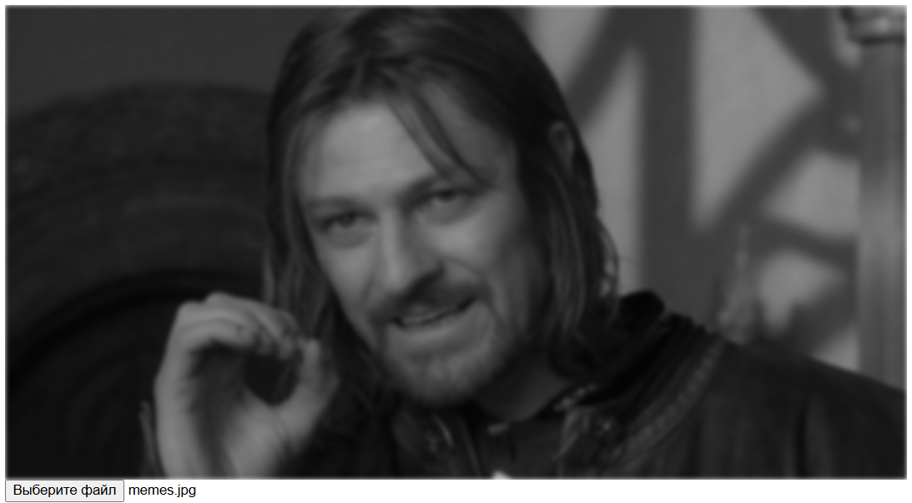

> [!NOTE]
> Значение `blur(2px)` я подобрал опытным путём. Кажется,
> что оно должно быть разным для фото разного размера, но,
> т.к. делаем мы это всё под конкретный случай, 
> то не будем заморачиваться.

Теперь сам Собель. Суть простая: прогоняем по картинке две свёртки 3x3 — одна считает вертикальные перепады яркости, вторая горизонтальные. Там, где перепад большой — там граница. Длина вектора градиента (`sqrt(gx*gx + gy*gy)`) и будет "силой" границы в пикселе:

```diff
***************
*** 10,15 ****
--- 10,17 ----
          ctx.filter = 'grayscale(1) blur(2px)';
          ctx.drawImage(img, 0, 0);
+         let imageData = ctx.getImageData(0, 0, cv.width, cv.height);
+         const mag = sobel(imageData, cv.width, cv.height);
+         showEdges(imageData, mag);
+         ctx.putImageData(imageData, 0, 0);
      }
```

```js
const GX = [-1, 0, 1,
            -2, 0, 2,
            -1, 0, 1];
const GY = [ 1,  2,  1,
             0,  0,  0,
            -1, -2, -1];

const sobel = (imageData, w, h) => {
    const src = imageData.data;
    const mag = new Float32Array(w * h);
    for (let y = 1; y < h - 1; y++) {
        for (let x = 1; x < w - 1; x++) {
            let gx = 0, gy = 0, k = 0;
            for (let dy = -1; dy <= 1; dy++) {
                for (let dx = -1; dx <= 1; dx++, k++) {
                    // картинка уже ч/б, берём любой канал (r)
                    const v = src[((y + dy) * w + (x + dx)) * 4];
                    gx += v * GX[k];
                    gy += v * GY[k];
                }
            }
            mag[y * w + x] = Math.sqrt(gx * gx + gy * gy);
        }
    }

    return mag;
}
```

Плюс функция `showEdges`, которая нормирует магнитуды в 0..255 и пишет обратно в `imageData` чтобы увидеть карту границ. Смотрим:

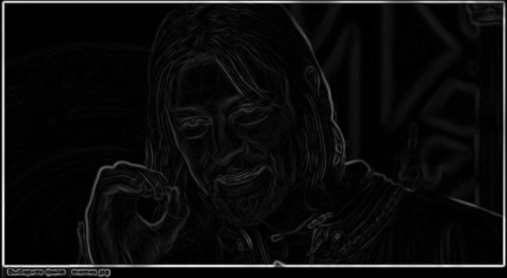

Голова, рука и даже рамка скриншота выделились отлично. Теперь из этого надо как-то достать лицо.

### Ищем лицо

Вспомним эвристику из пролога: овал, два овала поменьше, черты... Фиттить эллипс по облаку точек — удовольствие сомнительное. Но есть признак попроще: **лицо примерно симметрично** относительно вертикальной оси, а фон — обычно нет.

План такой:

1. границы сильнее порога переводим в бинарную маску (рамы и поля скриншота выкидываем сразу);
1. "утолщаем" границы на пару пикселей — иначе тонкие линии Собеля зеркально друг в друга не попадут;
1. для каждой колонки считаем, сколько границ слева имеют зеркальную пару справа — максимум и есть ось симметрии;
1. ширину лица берём по плотности границ в колонках вокруг оси;
1. верх головы — первая строка с устойчивой плотностью границ внутри найденной полосы;
1. подбородок эвристикой от торса и текста не отделить, поэтому берём классическую пропорцию: высота лица ~ 1.25 ширины.

Получилось такое:

```js
// порог для бинарной маски - подобран опытным путём
const EDGE_TH = 100;

const findFace = (mag, w, h) => {
    // бинарная маска границ; рамки/поля скриншотов выкидываем сразу
    const mx = Math.round(w * 0.03), my = Math.round(h * 0.03);
    const mask = new Uint8Array(w * h);
    for (let y = my; y < h - my; y++) {
        for (let x = mx; x < w - mx; x++) {
            mask[y * w + x] = mag[y * w + x] > EDGE_TH ? 1 : 0;
        }
    }

    // "утолщаем" границы
    const DR = 2;
    const dil = new Uint8Array(w * h);
    for (let y = DR; y < h - DR; y++) {
        for (let x = DR; x < w - DR; x++) {
            if (mask[y * w + x]) {
                for (let dy = -DR; dy <= DR; dy++) {
                    for (let dx = -DR; dx <= DR; dx++) {
                        dil[(y + dy) * w + x + dx] = 1;
                    }
                }
            }
        }
    }

    // ось симметрии
    const YMAX = Math.round(h * 0.62); // головы живут в верхней части кадра
    const R = Math.round(w * 0.12);    // половина ожидаемой ширины лица
    let cx = mx, best = 0;
    for (let c = mx; c < w - mx; c++) {
        let score = 0;
        for (let d = 1; d <= R; d++) {
            for (let y = my; y < YMAX; y++) {
                score += dil[y * w + c - d] * dil[y * w + c + d];
            }
        }
        if (score > best) {
            best = score;
            cx = c;
        }
    }

    // ширина лица по плотности границ вокруг оси
    const profX = new Float32Array(w);
    for (let x = 0; x < w; x++) {
        for (let y = 0; y < YMAX; y++) {
            profX[x] += mask[y * w + x];
        }
    }
    const sProfX = smooth(profX, Math.round(w * 0.02));
    const xTh = sProfX[cx] * 0.4;
    let l = cx;
    while (l > Math.max(0, cx - R) && sProfX[l] > xTh) l--;
    let r = cx;
    while (r < Math.min(w - 1, cx + R) && sProfX[r] > xTh) r++;

    // верх головы по плотности границ в строках внутри полосы
    const profY = new Float32Array(h);
    for (let y = 0; y < h; y++) {
        for (let x = l; x <= r; x++) {
            profY[y] += mask[y * w + x];
        }
    }
    const sProfY = smooth(profY, Math.round(h * 0.02));
    let maxY = 0;
    for (let y = 0; y < h; y++) {
        if (sProfY[y] > sProfY[maxY]) maxY = y;
    }
    const yTh = sProfY[maxY] * 0.35;
    let top = 0;
    while (top < h && sProfY[top] < yTh) top++;

    const height = Math.min(h - top, Math.round((r - l) * 1.25));
    return [l, top, r - l, height];
}
```

`smooth` — обычное скользящее среднее, чтобы одиночные всплески (строка текста, рамка) не ломали профиль. Рисуем рамку поверх фото через `ctx.strokeRect` и проверяем на исходной задаче — странице getmentor:

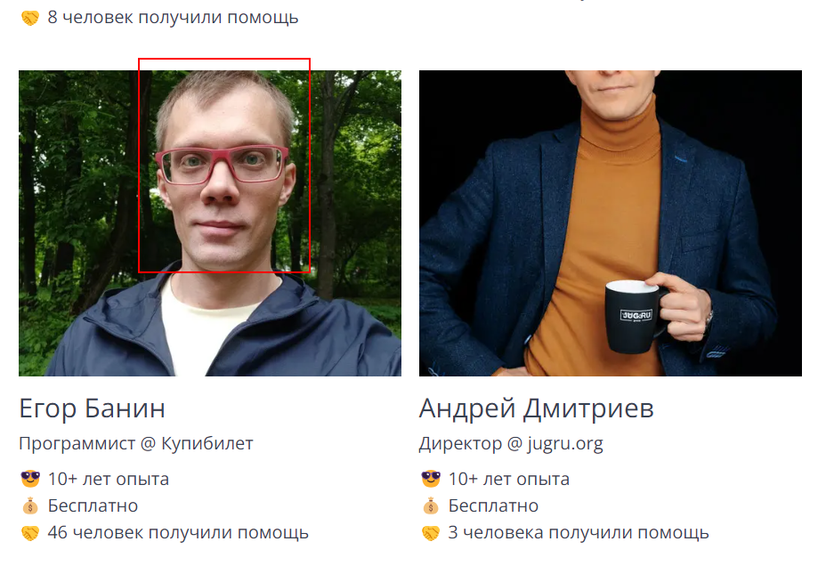

О! Нельзя просто так взять и... нет, подождите, ВЗЯЛИ и нашли лицо. На той самой странице, с которой всё началось, эвристика отработала прилично.

### Где всё ломается

Теперь честно — Боромир:

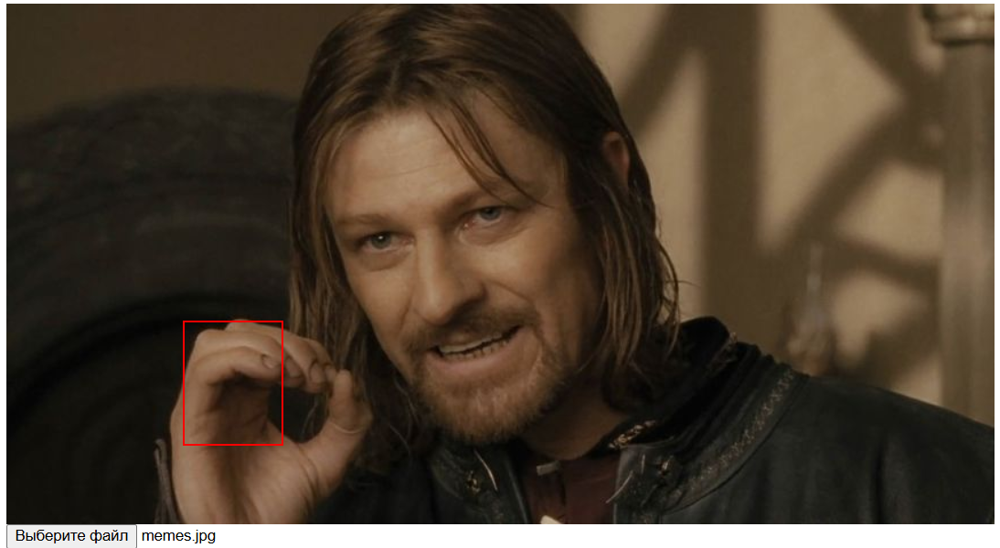

Вместо лица рамка легла на пальцы руки и арку за спиной. Причины на поверхности:

- голова наклонена — вертикальная симметрия слабая;
- волосы асимметричны;
- арка на фоне слева симметрична *лучше* лица;
- рука даёт плотных границ больше, чем лицо.

Короче: эвристика работает на «портрет анфас на спокойном фоне» — ровно на том случае, ради которого всё затевалось, — но чуть отойди от него и всё. Подкручивать можно долго (кожа по цвету, второй проход поиска, проверка овала), но это дорога в бесконечность.

### Как делают по-взрослому: pico.js

Помните, в начале гуглился алгоритм Виолы-Джонса? Так вот, есть его духовный наследник, который можно подключить в три строки: [pico.js](https://github.com/nenadmarkus/picojs) — ~200 строк чистого JS, 2kB, без нейросетей и OpenCV. Внутри — каскад решающих деревьев, обученный заранее: детектор пробегает по картинке окнами разного размера и каждое окно классифицирует попарными сравнениями яркости пикселей.

Понадобится сам `pico.js` и бинарный файл каскада `facefinder` из родительского репозитория `nenadmarkus/pico`. Код:

```js
// грузим обученный каскад
let classifyRegion = null;
fetch('facefinder')
    .then(response => response.arrayBuffer())
    .then(buffer => {
        classifyRegion = pico.unpack_cascade(new Int8Array(buffer));
    })

// pico ждёт ч/б картинку однобайтовыми пикселями
const rgba = ctx.getImageData(0, 0, cv.width, cv.height).data;
const pixels = new Uint8Array(cv.width * cv.height);
for (let i = 0; i < pixels.length; i++) {
    pixels[i] = Math.round(
        0.299 * rgba[i * 4] + 0.587 * rgba[i * 4 + 1] + 0.114 * rgba[i * 4 + 2]
    );
}

const image = {
    pixels: pixels,
    nrows: cv.height,
    ncols: cv.width,
    ldim: cv.width,
};
const params = {
    shiftfactor: 0.1,
    minsize: Math.min(cv.width, cv.height) * 0.15,
    maxsize: Math.min(cv.width, cv.height) * 0.9,
    scalefactor: 1.1,
};

let dets = pico.run_cascade(image, classifyRegion, params);
dets = pico.cluster_detections(dets, 0.2);

for (const [r, c, s, q] of dets) {
    if (q < 5.0) continue; // отсекаем слабые срабатывания
    ctx.strokeRect(c - s / 2, r - s / 2, s, s);
}
```

И вот результат на том самом кадре, где эвристика нашла пальцы:

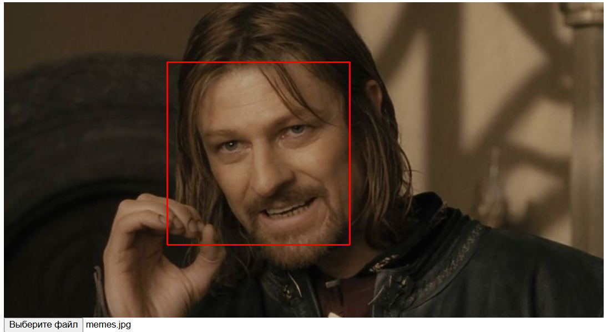

Наклон головы, волосы, арка — всё равно. Обученный детектор видит лицо там, где наши эвристики видят набор границ.

### Итог

Что имеем:

- ручной пайплайн (grayscale → blur → Собель → симметрия → плотность) решает исходную задачу — найти лицо на аватарке — и весь код умещается на пару экранов;
- но он хрупкий: наклон головы, узорчатый фон и чужие руки в кадре ломают его мгновенно;
- pico.js весит 2kB, не требует нейросетей и OpenCV и решает задачу надёжно — детектор обучен заранее, рантайм остаётся примитивным.

Если чинить аватарки всерьёз — берите pico.js. Если хочется понять, как вообще находят лица — пройдите путь с эвристикой, оно того стоит.

---

- [Issue](https://github.com/4irik/log/issues) для комментариев. <!-- TODO: заменить на конкретный issue после создания -->
- Анонс в телеграм-канале. <!-- TODO: добавить ссылку после публикации -->

<!-- Опять идём в гугл. Находим такое - https://aryamansharda.medium.com/image-filters-gaussian-blur-eb36db6781b1. Перепишем на JS, но сначала я хочу написать вспомогательную функцию чтобы каждый раз не вычислять на какое смещение нужно пододвинуть указатель чтобы попасть ровно строкой ниже (`imageData.data` возвращает нам одномерный массив, а хотелось бы, для наглядности, работать с двумерным).

```js
const matrix2flat = width => 
    (x, y) => {
        if (x*y > Math.pow(width-1, 2)) {
            throw new Error(`x (${x}) and y (${y}) do not grows then with (${width-1})`);
        }
        return x * width + y
    };
```

Тут же проверим:

```js
let a = [
    0, 2, 4,
    6 ,8 ,10,
    12, 14, 16
];
let m_2_f = matrix2flat(Math.sqrt(a.length));
console.table([
    ["(0, 0)", m_2_f(0,0), 0 == a[m_2_f(0, 0)]],
    ["(0, 2)", m_2_f(0,2), 4 == a[m_2_f(0, 2)]],
    ["(1, 1)", m_2_f(1,1), 8 == a[m_2_f(1, 1)]],,
    ["(2, 1)", m_2_f(2,1), 14 == a[m_2_f(2, 1)]],
    ["(2, 2)", m_2_f(2,2), 16 == a[m_2_f(2, 2)]],
]);
```

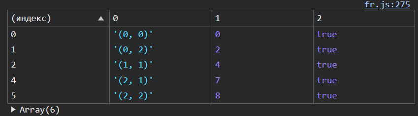
 -->
